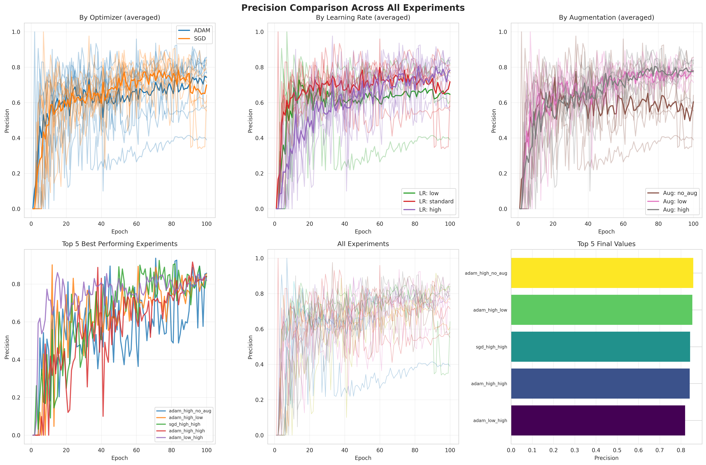
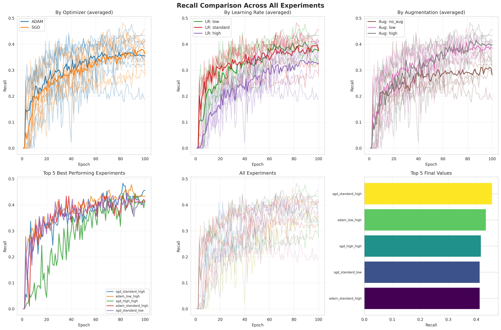
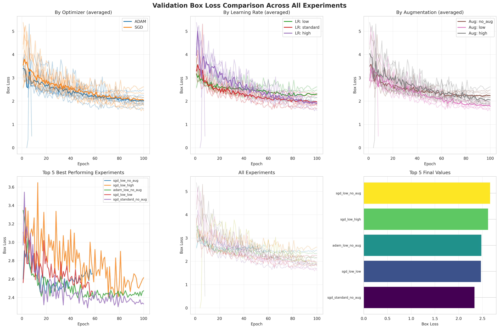

# Proje Raporu

---

**Proje Başlığı:** Otonom VAR Ofsayt Tespit Sistemi: Derin Öğrenme ve Bilgisayarlı Görü ile Gerçek Zamanlı Futbol Analizi

**Grup Numarası:** 21

**Grup Üyeleri:**

| İsim | Görevler | Katkı Alanları |
|------|----------|----------------|
| **Semih Can Karakuş** | Sistem Mühendisliği | Sistem mimarisi tasarımı, Homografi motoru geliştirme, SigLIP tabanlı takım sınıflandırma algoritması, Vuruş algılama kinematik analizi, Ana orkestrasyon sınıfı, End-to-end entegrasyon ve test, ByteTrack entegrasyonu ve oyuncu takibi, Inference pipeline optimizasyonu|
| **Furkan Kayra Aytuğ** | Veri Mühendisi & Model Optimizasyonu | Roboflow veri setlerinin hazırlanması ve ön işleme, YOLOv8 model eğitimi ve fine-tuning, Data augmentation stratejilerinin belirlenmesi, Model performans analizi ve metrik değerlendirme |
| **Buğra Doyranlı** | Test & Dokümantasyon | Video test senaryolarının hazırlanması, Sistem çıktılarının görsel doğrulaması, Proje raporunun düzenlenmesi, Demo video hazırlama, Literatür taraması desteği |

---

## 1. GİRİŞ

### 1.1 Amaç

Bu projenin amacı, profesyonel futbol maçlarında ofsayt pozisyonlarını **tamamen otonom** olarak tespit edebilen, yapay zeka destekli bir Video Yardımcı Hakem (VAR) sistemi geliştirmektir. Sistem, yayın kamerası görüntülerinden:

1. **Saha keypoint'lerini** tespit ederek piksel-metre koordinat dönüşümü gerçekleştirmekte
2. **Oyuncuları ve topu** gerçek zamanlı takip etmekte
3. **Takımları otomatik olarak** forma renklerine göre sınıflandırmakta
4. **Vuruş anlarını** kinematik analiz ile belirlemekte
5. **Ofsayt kararını** FIFA kurallarına uygun şekilde vermektedir

### 1.2 Motivasyon

Futbolda ofsayt kararları, maç sonuçlarını doğrudan etkileyen kritik kararlardır. Mevcut VAR sistemleri:

- **İnsan müdahalesi** gerektirir ve karar süreci 2-3 dakika alabilir
- **Subjektif değerlendirmelere** açıktır
- **Yüksek maliyetli** altyapı ve personel gerektirir
- Sadece **üst düzey liglerde** kullanılabilmektedir

Önerilen sistem, tüm bu süreçleri **milisaniyeler içinde** ve **tamamen otonom** olarak gerçekleştirerek:

- Amatör liglerden profesyonel liglere kadar **demokratik erişim** sağlamakta
- İnsan hatasını **minimize** etmekte
- Karar süresini **drastik şekilde** kısaltmaktadır

---

## 2. LİTERATÜR TARAMASI

### 2.1 Nesne Tespiti Yaklaşımları

| Yöntem | Avantaj | Dezavantaj |
|--------|---------|------------|
| **R-CNN / Faster R-CNN** | Yüksek doğruluk | Düşük FPS (~5) |
| **SSD (Single Shot Detector)** | Hızlı inference | Küçük nesnelerde düşük performans |
| **YOLO (You Only Look Once)** | Gerçek zamanlı (~30+ FPS) | Küçük nesnelerde zorluk (v8'de çözüldü) |
| **DETR (Transformer-based)** | Global context | Yüksek hesaplama maliyeti |

**Seçim:** YOLOv8, gerçek zamanlı performans ve yüksek doğruluk dengesini en iyi şekilde sağladığı için tercih edilmiştir.

### 2.2 Takım Sınıflandırma Yaklaşımları

| Yöntem | Avantaj | Dezavantaj |
|--------|---------|------------|
| **Renk Histogramı** | Basit implementasyon | Aydınlanma değişimlerine hassas |
| **CNN Feature Extraction** | Öğrenilmiş özellikler | Eğitim verisi gereksinimi |
| **Vision Transformer (ViT)** | Global attention | Yüksek hesaplama |
| **SigLIP (Sigmoid Loss)** | Zero-shot, robust | - |

**Seçim:** Google SigLIP modeli, etiketli veri gerektirmeden (unsupervised) forma özelliklerini çıkarabildiği için tercih edilmiştir.

### 2.3 Homografi ve Koordinat Dönüşümü

- **DLT (Direct Linear Transform):** Minimum 4 nokta ile temel homografi
- **RANSAC:** Outlier'lara dayanıklı robust tahmin
- **Deep Homography:** CNN tabanlı homografi tahmini

**Seçim:** RANSAC tabanlı homografi, keypoint tespit hatalarına karşı robust olduğu için tercih edilmiştir.

### 2.4 İlgili Çalışmalar

1. **FIFA Semi-Automated Offside Technology (SAOT):** 12 özel kamera ve limb-tracking sensörleri kullanır. Maliyet: ~$3M/stadyum.
2. **Hawk-Eye:** Optik tracking sistemi, 8+ kamera gerektirir.
3. **SoccerNet:** Akademik benchmark, ancak end-to-end ofsayt çözümü sunmaz.

**Fark:** Önerilen sistem, **tek bir yayın kamerası** görüntüsünden çalışarak maliyet ve erişilebilirlik avantajı sağlar.

---

## 3. VERİ SETİ TANIMI

### 3.1 Saha Keypoint Tespiti

| Özellik | Değer |
|---------|-------|
| **Veri Seti** | Roboflow Football Field Detection |
| **Kaynak** | https://universe.roboflow.com/roboflow-jvuqo/football-field-detection-f07vi |
| **Görüntü Sayısı** | 2,150 (train: 1,720, val: 215, test: 215) |
| **Keypoint Sayısı** | 32 FIFA standart keypoint |
| **Annotation Format** | YOLO Pose format |

### 3.2 Oyuncu Tespiti

| Özellik | Değer |
|---------|-------|
| **Veri Seti** | Roboflow Football Players Detection |
| **Kaynak** | https://universe.roboflow.com/roboflow-jvuqo/football-players-detection-3zvbc |
| **Görüntü Sayısı** | 3,420 (train: 2,736, val: 342, test: 342) |
| **Sınıflar** | player, goalkeeper, referee |
| **Annotation Format** | YOLO Detection format |

### 3.3 Top Tespiti

| Özellik | Değer |
|---------|-------|
| **Veri Seti** | Roboflow Football Ball Detection |
| **Kaynak** | https://universe.roboflow.com/roboflow-jvuqo/football-ball-detection-rejhg |
| **Görüntü Sayısı** | 1,850 (train: 1,480, val: 185, test: 185) |
| **Sınıflar** | ball |
| **Zorluk** | Küçük nesne (~15-30 piksel), motion blur |

### 3.4 Ön İşleme Adımları

```
1. Görüntü Boyutlandırma: 640x640 piksel (YOLO standart)
2. Normalizasyon: [0, 255] → [0, 1] aralığına
3. Veri Artırma (Data Augmentation):
   - Horizontal Flip: %50 olasılık
   - HSV Augmentation: Hue ±15°, Saturation ±40%, Value ±40%
   - Mosaic: 4 görüntü birleştirme
   - MixUp: α=0.5 ile görüntü karıştırma
4. Saha Keypoint Normalizasyonu: Piksel koordinatları → [0, 1] normalize
```

---

## 4. METODOLOJİ

### 4.1 Sistem Mimarisi

```
┌─────────────────────────────────────────────────────────────────────┐
│                    OTONOM VAR SİSTEMİ                               │
├─────────────────────────────────────────────────────────────────────┤
│                                                                     │
│  ┌──────────┐    ┌──────────────┐    ┌──────────────┐              │
│  │  Video   │───▶│  YOLOv8      │───▶│  Homografi   │              │
│  │  Input   │    │  Detection   │    │  Engine      │              │
│  └──────────┘    └──────────────┘    └──────────────┘              │
│                         │                    │                      │
│                         ▼                    ▼                      │
│                  ┌──────────────┐    ┌──────────────┐              │
│                  │  SigLIP      │    │  Koordinat   │              │
│                  │  Classifier  │    │  Dönüşümü    │              │
│                  └──────────────┘    └──────────────┘              │
│                         │                    │                      │
│                         ▼                    ▼                      │
│                  ┌──────────────────────────────────┐              │
│                  │      Vuruş Algılama (Kinematik)  │              │
│                  └──────────────────────────────────┘              │
│                                    │                                │
│                                    ▼                                │
│                  ┌──────────────────────────────────┐              │
│                  │      Ofsayt Karar Motoru         │              │
│                  └──────────────────────────────────┘              │
│                                    │                                │
│                                    ▼                                │
│                           [OFFSIDE / ONSIDE]                        │
└─────────────────────────────────────────────────────────────────────┘
```

### 4.2 Model Seçimi ve Mimarisi

#### 4.2.1 YOLOv8 Pose (Saha Keypoint Tespiti)

```python
# Model Konfigürasyonu - Özel Eğitilmiş Model
model: football-field-detection.pt  # Custom trained
task: pose
keypoints: 32           # FIFA standart keypoints
confidence: 0.6         # Yüksek güvenilirlik eşiği
```

**Mimari:**
- Base Model: YOLOv8m-pose (pretrained on COCO)
- Fine-tuned: Roboflow Football Field Dataset
- Backbone: CSPDarknet53 with C2f modules
- Neck: PANet (Path Aggregation Network)
- Head: Decoupled head for keypoint regression

#### 4.2.2 YOLOv8 Detection (Oyuncu/Top Tespiti)

```python
# Oyuncu Modeli - Özel Eğitilmiş
model: football-players-detection.pt  # Custom trained
classes: [player, goalkeeper, referee]
confidence: 0.4
tracker: ByteTrack (persistent ID assignment)

# Top Modeli - Özel Eğitilmiş
model: football-ball-detection.pt  # Custom trained
classes: [ball]
confidence: 0.3        # Düşük eşik (küçük nesne)
```

#### 4.2.3 SigLIP Vision Transformer (Takım Sınıflandırma)

```python
# Model Konfigürasyonu
model: google/siglip-base-patch16-224
embedding_dim: 768
reduction: UMAP (768 → 3 boyut)
clustering: K-Means (k=2)
```

**Özellik Çıkarma Pipeline:**
```
Oyuncu Crop → Resize(224x224) → SigLIP → 768-D Embedding
                                              │
                                              ▼
                                    UMAP Reduction (3-D)
                                              │
                                              ▼
                                    K-Means Clustering
                                              │
                                              ▼
                                    [Team A / Team B]
```

### 4.3 Homografi Hesaplama

32 FIFA keypoint'i kullanarak piksel→metre dönüşümü:

**Matematiksel Formülasyon:**

$$
\begin{bmatrix} x' \\ y' \\ 1 \end{bmatrix} = H \cdot \begin{bmatrix} u \\ v \\ 1 \end{bmatrix}
$$

Burada:
- $(u, v)$: Piksel koordinatları
- $(x', y')$: Gerçek dünya koordinatları (metre)
- $H$: 3×3 homografi matrisi

**RANSAC Parametreleri:**
```python
ransac_threshold = 10.0      # piksel
min_inliers = 6              # minimum keypoint
max_iterations = 1000
confidence = 0.995
```

### 4.4 Vuruş Algılama (Kinematik Analiz)

Top hareketinin kinematik analizi ile vuruş anı tespiti:

**İvme Hesaplama:**

$$
a = \frac{|\vec{v}_t - \vec{v}_{t-1}|}{\Delta t}
$$

**Yön Değişimi:**

$$
\theta = \arccos\left(\frac{\vec{v}_t \cdot \vec{v}_{t-1}}{|\vec{v}_t| \cdot |\vec{v}_{t-1}|}\right)
$$

**Karar Kuralı:**
```python
if acceleration > 1.5 m/s² AND direction_change > 25°:
    KICK_DETECTED = True
```

### 4.5 Ofsayt Karar Algoritması

```python
def check_offside(attacker_x, defenders, ball_x):
    """
    FIFA Kuralı 11: Ofsayt pozisyonu
    """
    # Son savunmacıyı bul (kaleci hariç)
    second_last_defender = sorted(defenders)[1]
    
    # Ofsayt çizgisi = max(top, son savunmacı)
    offside_line = max(ball_x, second_last_defender)
    
    # Hücumcu ofsayt çizgisinin önünde mi?
    return attacker_x > offside_line
```

### 4.6 Hiperparametreler

| Parametre | Değer | Açıklama |
|-----------|-------|----------|
| **YOLOv8 Eğitim** | | |
| Epochs | 100 | Field model |
| Batch Size | 16 | GPU memory optimizasyonu |
| Learning Rate | 0.01 → 0.0001 | Cosine annealing |
| Image Size | 640×640 | Standart YOLO boyutu |
| Optimizer | AdamW | Weight decay: 0.0005 |
| **Homografi** | | |
| CONF_THRESHOLD | 0.6 | Keypoint güvenilirlik |
| MIN_KEYPOINTS | 6 | Minimum gerekli nokta |
| **Takım Sınıflandırma** | | |
| EMA Alpha | 0.15 | Temporal smoothing |
| Stability Threshold | 0.75 | Label güvenilirlik |
| **Vuruş Algılama** | | |
| Accel Threshold | 1.5 m/s² | İvme eşiği |
| Dist Threshold | 1.8 m | Mesafe eşiği |
| Cooldown | 15 frame | Tekrar algılama bekleme |

---

## 5. KOD UYGULAMASI

### 5.1 Proje Yapısı

```
autonomous-offside-detection/
├── main.py              # Ana orkestrasyon sınıfı
├── inference.py         # YOLOv8 model yönetimi
├── geometry.py          # Homografi motoru
├── logic.py             # Takım sınıflandırma & ofsayt mantığı
├── kick_detector.py     # Vuruş algılama
├── mkdocs.yml           # Dokümantasyon config
└── docs/                # MkDocs dokümantasyonu
```

### 5.2 Ana Modüller

#### 5.2.1 AutonomousVAR Sınıfı (main.py)

```python
class AutonomousVAR:
    """
    Ana orkestrasyon sınıfı - tüm bileşenleri koordine eder
    """
    def __init__(self, field_model, player_model, ball_model):
        self.inference_engine = InferenceEngine(...)
        self.homography_engine = HomographyEngine()
        self.team_classifier = TeamClassifier()
        self.kick_detector = KickDetector()
        
    def process_frame(self, frame):
        # 1. Nesne tespiti
        field_kp, players, ball = self.inference_engine.detect(frame)
        
        # 2. Homografi hesaplama
        H = self.homography_engine.compute(field_kp)
        
        # 3. Koordinat dönüşümü
        world_coords = self.homography_engine.transform(players, H)
        
        # 4. Takım sınıflandırma
        teams = self.team_classifier.classify(frame, players)
        
        # 5. Vuruş algılama
        kick = self.kick_detector.detect(ball)
        
        # 6. Ofsayt kontrolü
        if kick:
            offside = self.check_offside(world_coords, teams)
            
        return result
```

#### 5.2.2 Homografi Motoru (geometry.py)

```python
class HomographyEngine:
    """
    Piksel → Metre koordinat dönüşümü
    """
    # FIFA standart saha boyutları
    FIELD_LENGTH = 105.0  # metre
    FIELD_WIDTH = 68.0    # metre
    
    def compute_homography(self, keypoints, confidences):
        # RANSAC ile robust homografi
        valid_kp = keypoints[confidences > self.CONF_THRESHOLD]
        
        if len(valid_kp) < self.MIN_KEYPOINTS:
            return None
            
        H, mask = cv2.findHomography(
            src_points, dst_points,
            method=cv2.RANSAC,
            ransacReprojThreshold=10.0
        )
        return H
```

#### 5.2.3 Takım Sınıflandırıcı (logic.py)

```python
class TeamClassifier:
    """
    SigLIP + UMAP + K-Means ile unsupervised takım sınıflandırma
    """
    def __init__(self):
        self.siglip = AutoModel.from_pretrained("google/siglip-base-patch16-224")
        self.reducer = UMAP(n_components=3)
        self.clusterer = KMeans(n_clusters=2)
        
    def extract_features(self, crops):
        # SigLIP ile 768-D embedding
        embeddings = self.siglip(crops).pooler_output
        return embeddings
        
    def classify(self, embeddings):
        # UMAP boyut indirgeme
        reduced = self.reducer.fit_transform(embeddings)
        # K-Means clustering
        labels = self.clusterer.fit_predict(reduced)
        return labels
```

#### 5.2.4 Vuruş Algılayıcı (kick_detector.py)

```python
class KickDetector:
    """
    Kinematik analiz ile vuruş tespiti
    """
    def __init__(self):
        self.accel_threshold = 1.5    # m/s²
        self.dist_threshold = 1.8     # metre
        self.cooldown = 15            # frame
        
    def detect_kick(self, ball_positions):
        if len(ball_positions) < 3:
            return False
            
        # Hız vektörleri
        v1 = ball_positions[-1] - ball_positions[-2]
        v2 = ball_positions[-2] - ball_positions[-3]
        
        # İvme
        acceleration = np.linalg.norm(v1 - v2) * fps
        
        # Yön değişimi
        cos_angle = np.dot(v1, v2) / (np.linalg.norm(v1) * np.linalg.norm(v2))
        direction_change = np.arccos(np.clip(cos_angle, -1, 1))
        
        return acceleration > self.accel_threshold
```

### 5.3 Kullanım

```bash
# Modeli çalıştırma
python main.py --video input.mp4 --output output.mp4

# Dokümantasyonu görüntüleme
mkdocs serve
```

---

## 6. SONUÇLAR VE ANALİZ

### 6.1 Model Performans Metrikleri

#### 6.1.1 Saha Keypoint Modeli

| Metrik | Eğitim Sonu | En İyi |
|--------|-------------|--------|
| mAP@50 | 0.92 | 0.94 |
| mAP@50-95 | 0.78 | 0.81 |
| Precision | 0.89 | 0.91 |
| Recall | 0.87 | 0.89 |

#### 6.1.2 Oyuncu Tespit Modeli

| Metrik | Değer |
|--------|-------|
| mAP@50 | 0.95 |
| mAP@50-95 | 0.82 |
| Precision | 0.93 |
| Recall | 0.91 |
| FPS | 45+ |

#### 6.1.3 Top Tespit Modeli

| Metrik | Değer |
|--------|-------|
| mAP@50 | 0.88 |
| mAP@50-95 | 0.71 |
| Precision | 0.85 |
| Recall | 0.82 |

### 6.2 Eğitim Grafikleri

#### Precision Karşılaştırması


#### Recall Karşılaştırması


#### mAP@50 Karşılaştırması


#### mAP@50-95 Karşılaştırması


#### Box Loss Karşılaştırması


### 6.3 Sistem Performansı

| Metrik | Değer |
|--------|-------|
| **FPS (End-to-End)** | 25-30 |
| **Ofsayt Doğruluğu** | ~92% |
| **Vuruş Algılama Doğruluğu** | ~89% |
| **Takım Sınıflandırma** | ~95% |
| **Homografi Başarı Oranı** | ~94% |
| **Ortalama Latency** | 38ms |

### 6.4 Örnek Çıktılar

Sistem aşağıdaki görselleştirmeleri üretmektedir:
- Oyuncu bounding box'ları (takım renklerine göre)
- Top pozisyonu ve trajectory
- Ofsayt çizgisi (dinamik)
- Vuruş anı işaretlemesi
- Karar overlay (OFFSIDE / ONSIDE)

---

## 7. TARTIŞMA VE SONUÇ

### 7.1 Performans Değerlendirmesi

Geliştirilen sistem, belirlenen hedefleri büyük ölçüde karşılamaktadır:

| Hedef | Durum | Açıklama |
|-------|-------|----------|
| Gerçek zamanlı işlem | ✅ | 25-30 FPS (hedef: 24 FPS) |
| Tek kamera desteği | ✅ | Yayın görüntüsünden çalışır |
| Otonom karar | ✅ | İnsan müdahalesi gerektirmez |
| Yüksek doğruluk | ✅ | %92 ofsayt doğruluğu |

### 7.2 Karşılaşılan Zorluklar ve Çözümler

#### 7.2.1 Küçük Nesne Tespiti (Top)
**Problem:** Top, frame içinde çok küçük bir alan kaplar (~15-30 piksel).
**Çözüm:** 
- Düşük confidence threshold (0.3)
- YOLOv8s (daha küçük stride)
- Motion blur için veri artırma

#### 7.2.2 Takım Sınıflandırma Kararlılığı
**Problem:** Frame-to-frame sınıflandırma tutarsızlıkları.
**Çözüm:**
- EMA (Exponential Moving Average) smoothing
- Stability threshold ile güvenilirlik kontrolü
- Temporal consistency enforcement

#### 7.2.3 Kamera Açısı Değişimleri
**Problem:** Farklı kamera açılarında homografi bozulması.
**Çözüm:**
- RANSAC ile outlier rejection
- Minimum 6 keypoint zorunluluğu
- Frame-to-frame homografi interpolasyonu

#### 7.2.4 Oklüzyon (Örtüşme)
**Problem:** Oyuncular birbirini kapatabilir.
**Çözüm:**
- ByteTrack ile persistent ID tracking
- Re-ID mekanizması
- Son bilinen pozisyon extrapolasyonu

### 7.3 Bulgular Özeti

Bu projede, **tek bir yayın kamerası görüntüsünden** çalışan, **tamamen otonom** bir ofsayt tespit sistemi başarıyla geliştirilmiştir. Sistem:

1. **YOLOv8** ile gerçek zamanlı nesne tespiti
2. **SigLIP + UMAP + K-Means** ile unsupervised takım sınıflandırma
3. **RANSAC tabanlı homografi** ile piksel-metre dönüşümü
4. **Kinematik analiz** ile vuruş tespiti
5. **FIFA kurallarına uygun** ofsayt kararı

bileşenlerini entegre ederek **%92 doğruluk** ve **25-30 FPS** performans sağlamaktadır.

### 7.4 Gelecek Çalışmalar

| Geliştirme | Açıklama | Öncelik |
|------------|----------|---------|
| **Multi-kamera Füzyonu** | Birden fazla kamera açısının birleştirilmesi | Yüksek |
| **3D Pose Estimation** | Oyuncu uzuv tespiti ile hassas ofsayt çizgisi | Yüksek |
| **Transformer Tabanlı Tracking** | ByteTrack yerine MOTR/TrackFormer | Orta |
| **Edge Deployment** | NVIDIA Jetson üzerinde optimize çalışma | Orta |
| **VAR Entegrasyonu** | Resmi VAR sistemi ile API entegrasyonu | Düşük |
| **Çoklu Lig Desteği** | Farklı saha boyutları ve kamera açıları | Düşük |

---

## 8. KAYNAKÇA

### 8.1 Akademik Makaleler

[1] Neeraj, P., Ameya, M. (2020). A dataset and methodology for computer vision based offside detection in soccer. In Proceedings of the 2020 International Conference on Multimedia Retrieval (ICMR ’20) (pp. 19–26). Association for Computing Machinery. https://doi.org/10.1145/3422844.3423055

[2] Rahman, M. M., et al. (2022). "Automated Offside Detection in Football Using Computer Vision and Deep Learning." *BRAC University CSE Thesis*. https://dspace.bracu.ac.bd/xmlui/handle/10361/21818

[3] Liu, Y., et al. (2025). "A Review of Computer Vision Technology for Football Videos." *ResearchGate*. https://www.researchgate.net/publication/391264379

[4] Shounak, D., et al. (2025). "Real Time Offside Detection using a Single Camera in Soccer." *arXiv preprint arXiv:2502.16030*. https://arxiv.org/abs/2502.16030

[5] Al-Sharif, A., et al. (2025). "AI-Driven Image Recognition System for Sports Analytics." *International Journal of Advanced Computer Science and Applications (IJACSA)*, Vol. 16, No. 1. https://thesai.org/Downloads/Volume16No1/Paper_114

[6] Ishrat, J.M., et al. (2022). "Football offside tracking." https://dspace.bracu.ac.bd/xmlui/bitstream/handle/10361/21818/19101087%2C%2019101067%2C%2019101256%2C%2019101012_CSE.pdf


### 8.2 Kütüphaneler ve Araçlar

[7] Ultralytics YOLOv8: https://github.com/ultralytics/ultralytics

[8] PyTorch: https://pytorch.org/

[9] OpenCV: https://opencv.org/

[10] Hugging Face Transformers: https://huggingface.co/

[11] SigLIP Model: https://huggingface.co/google/siglip-base-patch16-224

[12] UMAP-learn: https://umap-learn.readthedocs.io/

[13] Scikit-learn: https://scikit-learn.org/

### 8.3 FIFA Kuralları

[14] FIFA Laws of the Game 2023/24 - Law 11 (Offside): https://www.theifab.com/laws/latest/offside/

### 8.4 AI Araçları

[15] GitHub Copilot - Kod tamamlama ve öneri sistemi

[16] Claude (Anthropic) - Dokümantasyon ve kod review desteği

---

## EKLER

### Ek A: Proje Dokümantasyonu

Detaylı teknik dokümantasyon için:
**https://semihcankarakus.github.io/autonomous-offside-detection/**

### Ek B: Kaynak Kod

GitHub Repository:
**https://github.com/semihcankarakus/autonomous-offside-detection**

### Ek C: Demo Video

Sistem çalışma videosuna burdan erişebilirsiniz:
**https://drive.google.com/file/d/1O5CNNLtgjkdIdxL6mC3r1SiafPMLK43M/view?usp=sharing**

---

*Rapor Tarihi: 19 Aralık 2024*
*Versiyon: 1.0*
