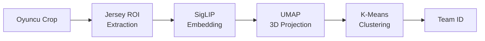

# Modül Yapısı ve API Referansı

Bu bölüm, sistemdeki her modülün detaylı API dokümantasyonunu içerir.

---

## Proje Dizin Yapısı

```
Offside_prof/
├── main.py              # Orchestrator - Ana giriş noktası
├── inference.py         # Deep Learning model yönetimi
├── geometry.py          # Homografi ve koordinat dönüşümleri
├── logic.py             # İş mantığı sınıfları
├── kick_detector.py     # Vuruş algılama (standalone)
├── mapper.py            # Keypoint mapping yardımcısı
├── football-field-detection.pt    # YOLOv8-Pose model
├── football-players-detection.pt  # YOLOv8 model
├── football-ball-detection.pt     # YOLOv8 model
└── docs/                # MkDocs dokümantasyonu
```

---

## InferenceEngine

**Modül:** `inference.py`

### Sınıf Tanımı

```python
class InferenceEngine:
    """
    Merkezi model yönetimi ve çıkarım motoru.
    Tüm YOLOv8 modellerini tek bir arayüz üzerinden yönetir.
    """
```

### Constructor

```python
def __init__(self, model_paths: Dict[str, str])
```

| Parametre | Tip | Açıklama |
|-----------|-----|----------|
| `model_paths` | `Dict[str, str]` | Model yolları: `{'field': '...', 'player': '...', 'ball': '...'}` |

### Metodlar

#### `predict_field(frame) -> Results`

Saha keypoint'lerini tespit eder (YOLOv8-Pose).

```python
result = engine.predict_field(frame)
keypoints = result.keypoints.xy[0]  # Shape: (32, 2)
confidences = result.keypoints.conf[0]  # Shape: (32,)
```

#### `predict_players(frame, conf=0.4) -> Results`

Oyuncuları tespit eder ve takip eder (ByteTrack).

```python
result = engine.predict_players(frame)
boxes = result.boxes.xyxy  # Bounding boxes
track_ids = result.boxes.id  # Tracking IDs
class_ids = result.boxes.cls  # 0: player, 1: goalkeeper, 3: referee
```

#### `predict_ball(frame) -> Results`

Topu tespit eder.

```python
result = engine.predict_ball(frame)
if len(result.boxes) > 0:
    ball_box = result.boxes[0].xyxy[0]
```

---

## GeometryEngine

**Modül:** `geometry.py`

### Sınıf Tanımı

```python
class GeometryEngine:
    """
    Dinamik anahtar nokta eşleşmeli Homografi Motoru.
    32 noktalı model çıktılarını metrik koordinatlara dönüştürür.
    """
```

### Sabitler

```python
PITCH_WIDTH = 105.0   # FIFA standart (metre)
PITCH_HEIGHT = 68.0   # FIFA standart (metre)
CONF_THRESHOLD = 0.6  # Minimum keypoint güveni
```

### Keypoint Mapping

32 FIFA standart nokta kullanılır:

```python
PITCH_KEYPOINTS = {
    0: [0, 0],           # Sol üst köşe
    1: [0, 13.85],       # Sol ceza sahası üst
    ...
    29: [105, 68]        # Sağ alt köşe
}
```

### Metodlar

#### `solve_from_model(keypoints, confidences) -> bool`

Model çıktısından homografi matrisi hesaplar.

```python
success = geometry.solve_from_model(
    kpts_from_model=keypoints.cpu().numpy(),
    confidences=confidences.cpu().numpy()
)
```

!!! note "RANSAC Kullanımı"
    Outlier (hatalı tespit edilen) keypoint'ler RANSAC ile elenir. Bu, kamera açısı değişikliklerinde bile stabil dönüşüm sağlar.

#### `pixel_to_pitch(points) -> np.ndarray`

Piksel koordinatlarını metre cinsine dönüştürür.

$$
\mathbf{p}_{\text{pitch}} = \mathbf{H} \cdot \mathbf{p}_{\text{pixel}}
$$

```python
# Input: [[u1, v1], [u2, v2], ...]
# Output: [[x1, y1], [x2, y2], ...] (metre)
pitch_coords = geometry.pixel_to_pitch(pixel_points)
```

#### `pitch_to_pixel(points) -> np.ndarray`

Metre koordinatlarını piksele dönüştürür.

$$
\mathbf{p}_{\text{pixel}} = \mathbf{H}^{-1} \cdot \mathbf{p}_{\text{pitch}}
$$

#### `get_offside_line(offside_x_metric) -> List[Tuple[int, int]]`

Ofsayt çizgisinin piksel koordinatlarını döndürür.

```python
# X = 35 metre'deki dikey çizgi
line_points = geometry.get_offside_line(35.0)
# Returns: [(px1, py1), (px2, py2)]
```

---

## ProfessionalTeamClassifier

**Modül:** `logic.py`

### Sınıf Tanımı

```python
class ProfessionalTeamClassifier:
    """
    SigLIP Vision Transformer + UMAP + K-Means tabanlı
    denetimsiz takım sınıflandırıcı.
    """
```

### Pipeline



### Metodlar

#### `extract_jersey_embeddings(crops) -> np.ndarray`

Forma bölgesinden görsel embedding çıkarır.

```python
# Jersey ROI: Görüntünün %20-%50 yükseklik, %25-%75 genişlik aralığı
embeddings = classifier.extract_jersey_embeddings(player_crops)
# Shape: (n_players, 768)
```

!!! tip "Neden Sadece Forma?"
    Tam vücut yerine sadece forma bölgesi kullanılır çünkü:
    
    - Bacaklar ve ayakkabılar her iki takımda da benzer
    - Yüz/saç farklılıkları gürültü ekler
    - Forma, takım kimliğinin en güçlü sinyalidir

#### `calibrate_step(crop, limit=30)`

Kalibre edilmemiş sistemde buffer'a örnek ekler.

#### `calibrate(crops)`

Buffer dolduktan sonra modeli eğitir:

1. SigLIP ile embedding çıkar
2. UMAP ile 3D'ye indirge
3. K-Means ile 2 kümeye ayır

#### `predict(crop) -> int`

Tek bir oyuncu için takım tahmini yapar.

```python
team_id = classifier.predict(player_crop)  # 0 veya 1
```

---

## TemporalTeamVoter

**Modül:** `logic.py`

### Amaç

Frame-by-frame tahminler gürültülü olabilir. Bu sınıf, **temporal voting** ile tahminleri stabilize eder.

### Parametreler

```python
window_size = 15        # Oylama penceresi
stability_threshold = 12  # Kilit için gerekli oy
```

### Metodlar

#### `vote(track_id, current_prediction) -> Tuple[int, bool]`

```python
team_id, is_stable = voter.vote(track_id=5, current_prediction=1)
```

| Dönen Değer | Açıklama |
|-------------|----------|
| `team_id` | En çok oy alan takım |
| `is_stable` | 15 frame'de 12+ aynı oy mu? |

#### `unlock_id(track_id)`

IoU çakışması durumunda kilidi açar:

```python
# İki oyuncu çakıştığında ID'ler karışabilir
voter.unlock_id(track_id)  # Yeniden analiz zorlanır
```

---

## OffsideLogic

**Modül:** `logic.py`

### Sınıf Tanımı

```python
class OffsideLogic:
    """
    Ofsayt çizgisi hesaplama ve atak yönü belirleme.
    """
```

### Durum Değişkenleri

```python
attacking_team_id: int    # Hücum eden takım (0 veya 1)
attack_direction: str     # "L2R" veya "R2L"
smoothed_line_x: float    # EMA filtrelenmiş çizgi
raw_line_x: float         # Filtresiz gerçek pozisyon
```

### Metodlar

#### `update_attacking_team(players, ball_coord)`

Top kontrolünü ve atak yönünü günceller:

1. **Top Kontrolü:** Topa en yakın takımı bul
2. **Hysteresis:** %75 baskınlık olmadan takım değiştirme
3. **Atak Yönü:** Takım centroid'lerine göre belirle

```python
logic.update_attacking_team(players, ball_coord)
print(logic.attacking_team_id)  # 0 veya 1
print(logic.attack_direction)   # "L2R" veya "R2L"
```

#### `calculate_offside_line(players) -> float`

```python
line_x = logic.calculate_offside_line(players)
```

**Algoritma:**

1. Savunmacıları (hücum eden olmayan takım) filtrele
2. X koordinatına göre sırala (atak yönüne bağlı)
3. **İkinci savunmacının** X'ini al (genellikle kaleci dahil)
4. EMA ile yumuşat

$$
\hat{x}_t = \alpha \cdot x_t + (1-\alpha) \cdot \hat{x}_{t-1}
$$

---

## KickDetector

**Modül:** `kick_detector.py`

### Sınıf Tanımı

```python
class KickDetector:
    """
    Kinematik analiz tabanlı vuruş algılayıcı.
    İvme ve yön değişimi kombinasyonu kullanır.
    """
```

### Parametreler

```python
accel_threshold = 1.5   # m/frame² ivme eşiği
dist_threshold = 1.8    # metre, oyuncu-top mesafesi
cooldown_frames = 20    # Vuruşlar arası minimum frame
```

### Telemetri

```python
telemetry = {
    "accel": 0.0,       # Anlık ivme
    "dir_change": 0.0,  # Yön değişimi (dot product)
    "min_dist": 99.0,   # En yakın oyuncuya mesafe
    "status": "ARMED",  # SEARCHING, ARMED, KICK!, COOLDOWN
    "reason": ""        # Neden tetiklenmedi
}
```

### Metodlar

#### `analyze(frame_idx, ball_coord, players) -> bool`

Her frame'de çağrılır, vuruş olup olmadığını döndürür.

```python
is_kick = detector.analyze(
    frame_idx=150,
    ball_coord=np.array([45.0, 34.0]),
    players=players_list
)
```

**Karar Mantığı:**

$$
\text{Kick} = (\|\mathbf{a}\| > 1.5 \lor \cos\theta < 0.3) \land (d_{\min} < 1.8)
$$

---

## FinalDecisionLogic

**Modül:** `logic.py`

### Metodlar

#### `process_decision(attackers, offside_line_x, direction) -> dict`

```python
result = logic.process_decision(
    attackers=[...],
    offside_line_x=35.0,
    direction="L2R"
)
# Returns: {"is_offside": True, "margin": 0.45}
```

**Karar:**

- **L2R:** Hücumcu X > Ofsayt Çizgisi X → **OFFSIDE**
- **R2L:** Hücumcu X < Ofsayt Çizgisi X → **OFFSIDE**

---

## Sonraki Bölümler

- [YOLOv8 Pipeline Detayları](../cv/yolo-pipeline.md)
- [Homografi Matematiği](../geometry/homography.md)
