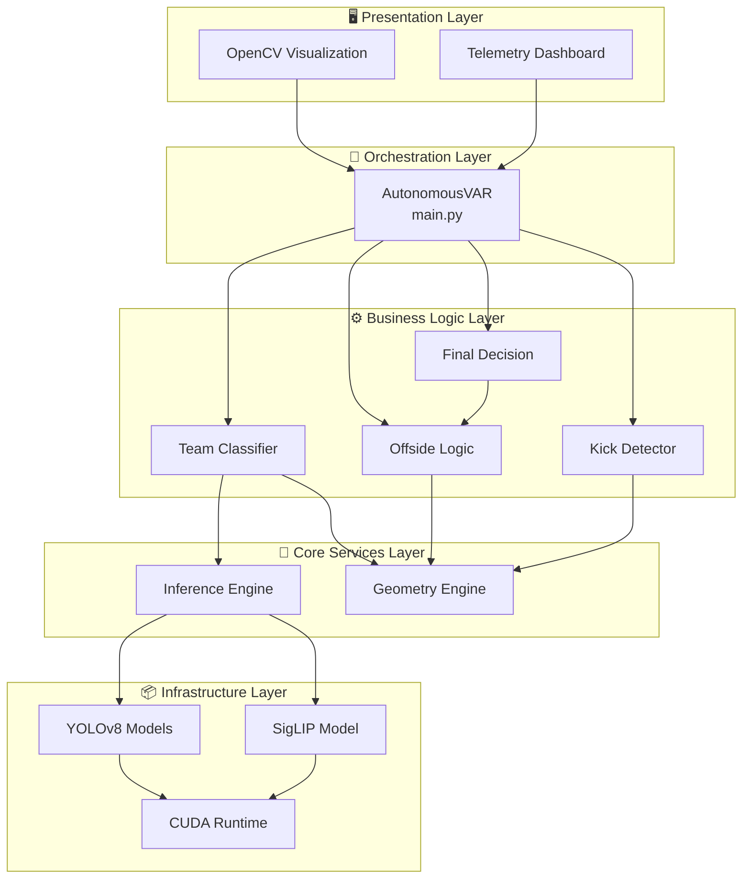
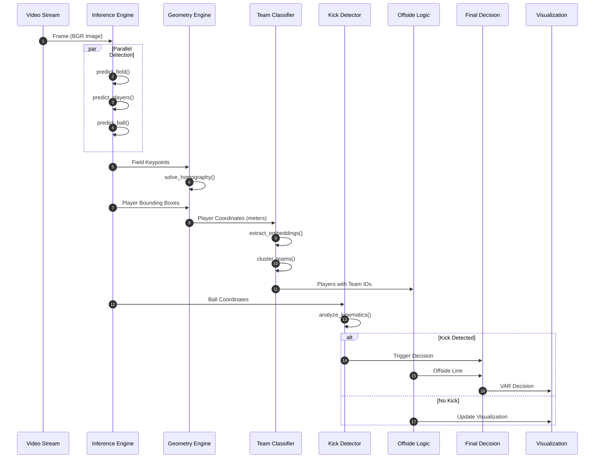
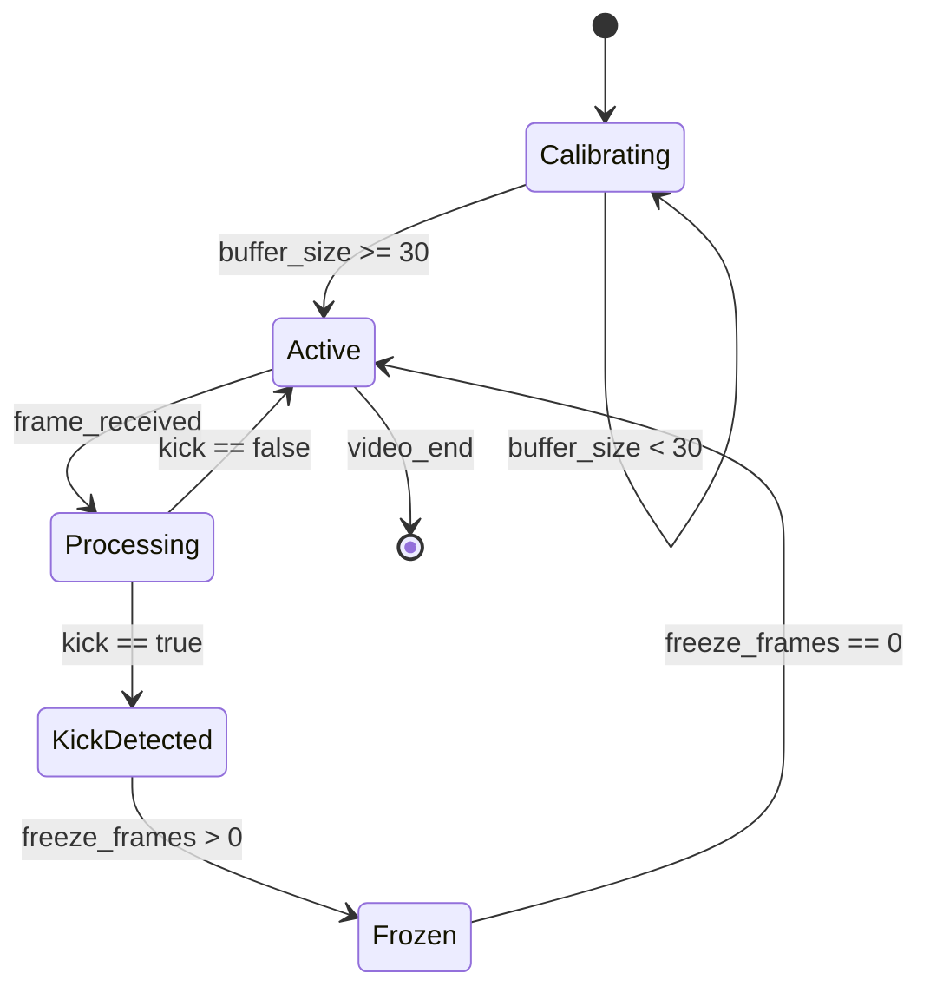
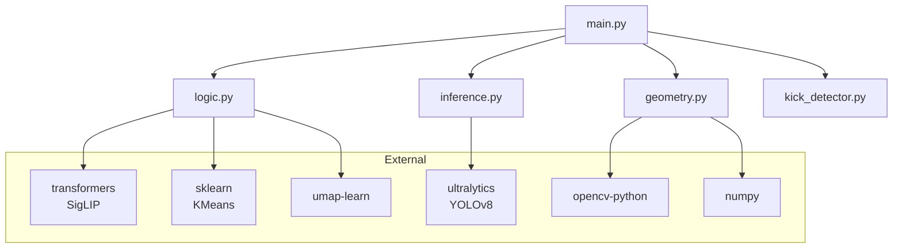

# Sistem Mimarisi: Genel Bakış

## Mimari Felsefe

Bu sistem, **Clean Architecture** ve **Separation of Concerns** prensipleri üzerine inşa edilmiştir. Her modül tek bir sorumluluğa sahiptir ve modüller arasındaki bağımlılıklar minimize edilmiştir.

!!! info "Tasarım Kararı"
    Monolitik bir yapı yerine **katmanlı mimari** tercih edilmiştir. Bu yaklaşım:
    
    - Unit test yazımını kolaylaştırır
    - Modüllerin bağımsız geliştirilmesine olanak tanır
    - Debugging ve profiling süreçlerini basitleştirir

---

## Katmanlı Mimari



---

## Veri Akışı (Data Flow)

Sistem, her frame için aşağıdaki pipeline'ı işletir:



---

## Ana Bileşenler

### 1. AutonomousVAR (Orchestrator)

**Dosya:** `main.py`

Tüm alt sistemleri koordine eden ana sınıf:

```python
class AutonomousVAR:
    def __init__(self, video_path, output_path):
        # Engine Initialization
        self.inference = InferenceEngine({...})
        self.geometry = GeometryEngine()
        self.team_classifier = ProfessionalTeamClassifier()
        self.team_voter = TemporalTeamVoter()
        self.kick_detector = KickDetector(fps=self.fps)
        self.offside_logic = OffsideLogic(fps=self.fps)
        self.final_logic = FinalDecisionLogic()
```

**Sorumluluklar:**

| Görev | Açıklama |
|-------|----------|
| Video I/O | Frame okuma ve video yazma |
| Engine Koordinasyonu | Alt sistemlerin sıralı çağrımı |
| State Management | Freeze frame, calibration durumu |
| Visualization | UI rendering ve dashboard |

---

### 2. InferenceEngine

**Dosya:** `inference.py`

Tüm deep learning model çıkarımlarını yönetir:

```python
class InferenceEngine:
    def __init__(self, model_paths: Dict[str, str]):
        self.field_model = YOLO(model_paths['field'], task='pose')
        self.player_model = YOLO(model_paths['player'], task='detect')
        self.ball_model = YOLO(model_paths['ball'], task='detect')
```

!!! warning "Performans Notu"
    Modeller **half precision (FP16)** modunda çalıştırılır. Bu, VRAM kullanımını ~%50 azaltır ve inference süresini kısaltır.

---

### 3. GeometryEngine

**Dosya:** `geometry.py`

Koordinat dönüşümlerini yönetir:

```python
class GeometryEngine:
    def solve_from_model(self, keypoints, confidences) -> bool:
        """RANSAC ile robust homografi hesaplar"""
        
    def pixel_to_pitch(self, points) -> np.ndarray:
        """Piksel → Metre dönüşümü"""
        
    def pitch_to_pixel(self, points) -> np.ndarray:
        """Metre → Piksel dönüşümü"""
```

---

### 4. Logic Layer

**Dosya:** `logic.py`

İş mantığını içeren sınıflar:

| Sınıf | Sorumluluk |
|-------|------------|
| `ProfessionalTeamClassifier` | SigLIP + UMAP + K-Means takım sınıflandırma |
| `TemporalTeamVoter` | Gürültülü tahminleri stabilize etme |
| `OffsideLogic` | Atak yönü ve ofsayt çizgisi hesaplama |
| `KickDetector` | Kinematik vuruş algılama |
| `FinalDecisionLogic` | VAR kararı üretme |

---

## Durum Makinesi (State Machine)

Sistem, iki ana durumda çalışır:



### Durumlar

| Durum | Açıklama |
|-------|----------|
| **Calibrating** | Takım sınıflandırıcı eğitiliyor (ilk 30 frame) |
| **Active** | Normal işleme modu |
| **Processing** | Frame analizi devam ediyor |
| **KickDetected** | Vuruş algılandı, VAR kararı bekleniyor |
| **Frozen** | Karar ekranı gösteriliyor (3 saniye) |

---

## Bağımlılık Grafiği



---

## Konfigürasyon Parametreleri

```python
# Inference Thresholds
FIELD_CONF = 0.5      # Saha keypoint güven eşiği
PLAYER_CONF = 0.4     # Oyuncu tespit güven eşiği
BALL_CONF = 0.3       # Top tespit güven eşiği

# Geometry
MIN_KEYPOINTS = 6     # Homografi için minimum nokta
RANSAC_THRESHOLD = 3.0 # RANSAC outlier eşiği

# Team Classification
CALIBRATION_BUFFER = 30  # Eğitim için gerekli frame sayısı
UMAP_COMPONENTS = 3       # UMAP çıktı boyutu
KMEANS_CLUSTERS = 2       # Takım sayısı

# Kick Detection
ACCEL_THRESHOLD = 1.5    # İvme eşiği (m/frame²)
DIST_THRESHOLD = 1.8     # Oyuncu-top mesafe eşiği (m)
COOLDOWN_FRAMES = 20     # Vuruşlar arası minimum frame

# Offside Logic
SMOOTHING_ALPHA = 0.15   # EMA yumuşatma faktörü
STABILITY_THRESHOLD = 0.75  # Takım değişimi için gerekli oran
```

---

## Sonraki Bölümler

- [Modül Yapısı](modules.md) - Her modülün detaylı API dokümantasyonu
- [Computer Vision Pipeline](../cv/yolo-pipeline.md) - YOLOv8 model detayları
