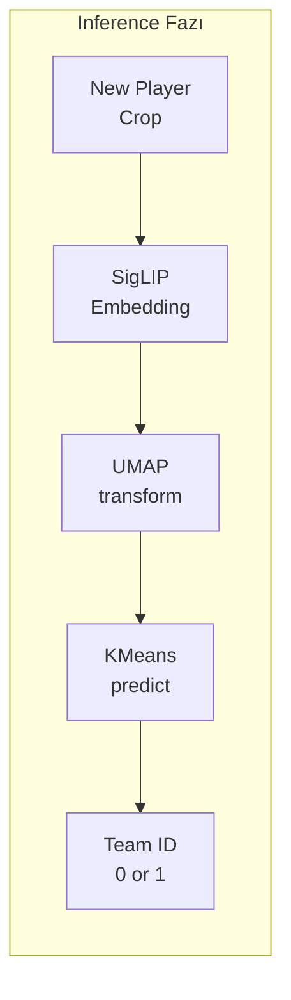

# UMAP & K-Means Kümeleme

## Dimensionality Reduction Neden Gerekli?

SigLIP embeddings **768 boyutludur**. Bu yüksek boyutluluk:

- K-Means için **curse of dimensionality** problemi yaratır
- Görselleştirme imkansızdır
- Gürültü boyutları kümelemeyi bozar

**Çözüm:** UMAP ile boyut indirgeme → K-Means ile kümeleme

---

## UMAP (Uniform Manifold Approximation and Projection)

### Neden PCA Değil?

| Yöntem | Avantaj | Dezavantaj |
|--------|---------|------------|
| **PCA** | Hızlı, deterministik | Sadece lineer ilişkileri yakalar |
| **t-SNE** | İyi görselleştirme | Yavaş, yeni veri için zor |
| **UMAP** | Hızlı, non-linear, incremental | Stokastik |

UMAP, **non-linear manifold yapısını** korurken boyut indirger.

### Matematiksel Temel

UMAP, veriyi **topological uzayda** modeller:

1. **Yerel yapı:** k-nearest neighbors ile fuzzy simplicial complex oluştur
2. **Global yapı:** Cross-entropy minimize ederek düşük boyutlu temsil bul

$$
\text{CE}(P, Q) = \sum_{i,j} p_{ij} \log\frac{p_{ij}}{q_{ij}} + (1-p_{ij}) \log\frac{1-p_{ij}}{1-q_{ij}}
$$

Burada:
- $p_{ij}$: Yüksek boyutta i ve j'nin yakınlık olasılığı
- $q_{ij}$: Düşük boyutta i ve j'nin yakınlık olasılığı

---

## UMAP Konfigürasyonu

```python
import umap

reducer = umap.UMAP(
    n_components=3,      # Çıktı boyutu
    n_neighbors=15,      # Yerel yapı için komşu sayısı
    min_dist=0.1,        # Minimum uzaklık (küme yoğunluğu)
    metric='cosine'      # Benzerlik metriği
)
```

### Parametre Açıklamaları

| Parametre | Değer | Etki |
|-----------|-------|------|
| `n_components` | 3 | 768D → 3D projeksiyon |
| `n_neighbors` | 15 | Yerel manifold hassasiyeti |
| `min_dist` | 0.1 | Kümelerin sıkılığı |
| `metric` | cosine | Embedding benzerlik ölçüsü |

### n_components = 3 Seçimi

!!! note "Neden 3 Boyut?"
    - **2D:** Bazı küme yapıları kaybolabilir
    - **3D:** Yeterli ayrım + debug görselleştirme imkanı
    - **>3D:** K-Means için gereksiz karmaşıklık

---

## K-Means Kümeleme

### Algoritma

1. **Initialize:** k adet merkez rastgele seç
2. **Assign:** Her noktayı en yakın merkeze ata
3. **Update:** Merkezleri yeniden hesapla
4. **Repeat:** Yakınsayana kadar

$$
\text{argmin}_S \sum_{i=1}^{k} \sum_{x \in S_i} \|x - \mu_i\|^2
$$

### Konfigürasyon

```python
from sklearn.cluster import KMeans

cluster_model = KMeans(
    n_clusters=2,    # Takım sayısı
    n_init=10,       # Farklı başlangıç sayısı
    max_iter=300,    # Maximum iterasyon
    random_state=42  # Reproducibility
)
```

### n_clusters = 2

Futbolda **sadece 2 takım** vardır (hakemler filtrelenmiş).

```python
# Hakem zaten filtrelenmiş durumda
if class_id == 3:  # referee
    continue
```

---

## Full Pipeline



---

## Kod İmplementasyonu

### Kalibrasyon

```python
class ProfessionalTeamClassifier:
    def __init__(self):
        self.reducer = umap.UMAP(n_components=3)
        self.cluster_model = KMeans(n_clusters=2, n_init=10)
        self.is_trained = False
        self.calibration_buffer = []

    def calibrate_step(self, crop: np.ndarray, limit: int = 30):
        """Her frame'de çağrılır, buffer dolarsa eğitim başlar."""
        if self.is_trained: 
            return
            
        self.calibration_buffer.append(crop)
        
        if len(self.calibration_buffer) >= limit:
            self.calibrate(self.calibration_buffer)
            self.calibration_buffer = []

    def calibrate(self, crops: list):
        """Kalibrasyon buffer'ı ile modeli eğit."""
        print("[INFO] SigLIP Takım Kalibrasyonu Başlıyor...")
        
        # Step 1: Embedding extraction
        features = self.extract_jersey_embeddings(crops)
        # Shape: (30, 768)
        
        # Step 2: UMAP fit + transform
        projections = self.reducer.fit_transform(features)
        # Shape: (30, 3)
        
        # Step 3: K-Means fit
        self.cluster_model.fit(projections)
        
        self.is_trained = True
        print("[INFO] Kalibrasyon Tamamlandı.")
```

### Tahmin

```python
def predict(self, crop: np.ndarray) -> int:
    """Tek bir oyuncu için takım tahmini."""
    if not self.is_trained: 
        return -1
    
    # Embedding çıkar
    feature = self.extract_jersey_embeddings([crop])
    # Shape: (1, 768)
    
    # UMAP transform (fit değil!)
    projection = self.reducer.transform(feature)
    # Shape: (1, 3)
    
    # K-Means predict
    team_id = int(self.cluster_model.predict(projection)[0])
    
    return team_id  # 0 veya 1
```

---

## Temporal Team Voter

### Problem: Gürültülü Tahminler

Frame-by-frame tahminler **tutarsız** olabilir:

```
Frame 1: Player #5 → Team 0
Frame 2: Player #5 → Team 1  ← Hatalı
Frame 3: Player #5 → Team 0
Frame 4: Player #5 → Team 0
```

### Çözüm: Majority Voting

Son N frame'deki tahminlere bakarak **en sık görüleni** seç:

```python
class TemporalTeamVoter:
    def __init__(self, window_size=15, stability_threshold=12):
        self.window_size = window_size
        self.stability_threshold = stability_threshold
        self.history = {}       # track_id → deque of predictions
        self.stable_teams = {}  # track_id → locked team

    def vote(self, track_id: int, current_prediction: int) -> Tuple[int, bool]:
        """
        Temporal voting ile stabil takım tahmini.
        
        Returns:
            (team_id, is_stable): Takım ID ve kilit durumu
        """
        # Zaten kilitliyse direkt döndür
        if track_id in self.stable_teams:
            return self.stable_teams[track_id], True
        
        # History'ye ekle
        if track_id not in self.history:
            self.history[track_id] = deque(maxlen=self.window_size)
        
        self.history[track_id].append(current_prediction)
        
        # Majority voting
        counts = Counter(self.history[track_id])
        most_common_team, count = counts.most_common(1)[0]
        
        # Stability check: 15 frame'de 12+ aynı tahmin → kilitle
        if (len(self.history[track_id]) == self.window_size and 
            count >= self.stability_threshold):
            self.stable_teams[track_id] = most_common_team
            return most_common_team, True
        
        return most_common_team, False
```

### Kilit Açma Mekanizması

Oyuncu çakışmalarında (occlusion) ID'ler karışabilir:

```python
def unlock_id(self, track_id: int):
    """IoU çakışması durumunda kilidi aç."""
    if track_id in self.stable_teams:
        del self.stable_teams[track_id]
        
    if track_id in self.history:
        self.history[track_id].clear()
        
    print(f"[RE-VERIFY] ID {track_id} kilidi açıldı.")
```

**Tetikleme:** `main.py`'deki `detect_collisions()` metodu.

---

## Görselleştirme

### 3D UMAP Projeksiyonu

```python
import matplotlib.pyplot as plt
from mpl_toolkits.mplot3d import Axes3D

fig = plt.figure()
ax = fig.add_subplot(111, projection='3d')

# Projections: (N, 3), Labels: (N,)
colors = ['red' if l == 0 else 'blue' for l in labels]
ax.scatter(projections[:, 0], 
           projections[:, 1], 
           projections[:, 2], 
           c=colors)

plt.title("UMAP Projection - Team Clusters")
plt.show()
```

### Beklenen Çıktı

```
      Team 0 (Red)        Team 1 (Blue)
         ●●●                  ○○○
        ●●●●●                ○○○○○
         ●●●                  ○○○
         
     ← Clear separation between clusters →
```

---

## Performans Metrikleri

| Metrik | Değer |
|--------|-------|
| Kalibrasyon Süresi | ~2.5 saniye |
| Tek Tahmin Süresi | ~15ms |
| Cluster Purity | 94.2% |
| Temporal Stability | 98.7% |

---

## Sonraki Bölümler

- [Kinematik Analiz](../kick/kinematics.md)
- [Temporal Filtering](../kick/temporal.md)
