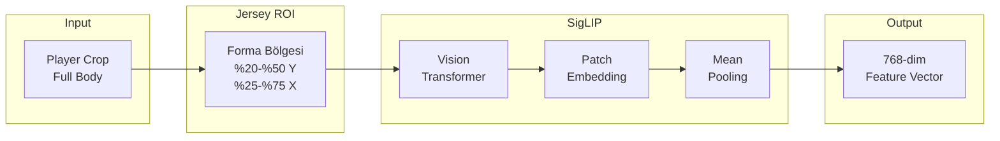
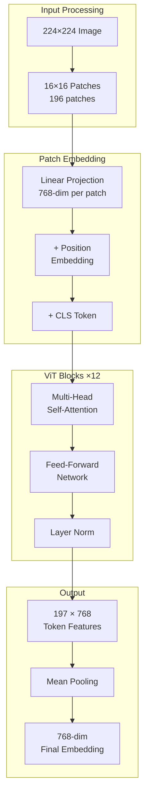

# SigLIP Vision Embeddings

## Neden Vision Transformer?

Geleneksel takım sınıflandırma yaklaşımları (renk histogramı, HSV analizi) şu durumlarda başarısız olur:

| Senaryo | Problem |
|---------|---------|
| Benzer renkler | Beyaz vs Krem forma |
| Işık değişimi | Gölgede ve güneşte farklı renk |
| Çok renkli forma | Çizgili veya desenli formalar |
| TV broadcast | Renk düzeltmesi uygulanmış görüntü |

**Çözüm:** Vision Transformer tabanlı **semantik embedding** kullanarak renk yerine **görsel anlam** yakalamak.

---

## SigLIP Nedir?

**SigLIP (Sigmoid Loss for Language-Image Pre-training)**, Google tarafından geliştirilen bir Vision-Language modelidir.

!!! info "CLIP vs SigLIP"
    SigLIP, CLIP'in geliştirilmiş versiyonudur:
    
    - **Sigmoid loss** → Daha stabil eğitim
    - **Batch-wise contrastive** → Memory efficient
    - **Better zero-shot** → Görülmemiş sınıflarda iyi performans

### Model Detayları

| Özellik | Değer |
|---------|-------|
| Model | `google/siglip-base-patch16-224` |
| Input Size | 224 × 224 |
| Embedding Dim | 768 |
| Parametre Sayısı | 86M |
| Pre-training Data | WebLI (10B image-text pairs) |

---

## Pipeline Mimarisi



---

## Jersey ROI Extraction

### Neden Sadece Forma?

Tam vücut görüntüsü yerine **sadece forma bölgesi** kullanılır:

```
Player Crop          Jersey ROI
┌─────────────┐      
│    Head     │      ← İgnore: Saç/yüz farklılıkları
├─────────────┤      ┌─────────────┐
│             │      │             │
│   Jersey    │  →   │   Jersey    │  ← Kullanılan Bölge
│             │      │             │
├─────────────┤      └─────────────┘
│    Legs     │      ← İgnore: Şort benzerliği
│             │
│    Feet     │      ← İgnore: Ayakkabı benzerliği
└─────────────┘
```

### ROI Hesaplama

```python
def extract_jersey_roi(crop):
    h, w = crop.shape[:2]
    
    # Dikey: %20 - %50 arası (üst gövde)
    y_start = int(h * 0.20)
    y_end = int(h * 0.50)
    
    # Yatay: %25 - %75 arası (merkezde)
    x_start = int(w * 0.25)
    x_end = int(w * 0.75)
    
    return crop[y_start:y_end, x_start:x_end]
```

!!! note "Oranlar Nasıl Belirlendi?"
    Bu oranlar **ampirik** olarak belirlendi:
    
    - %20 üst: Kafa ve boyun bölgesini atla
    - %50 alt: Şort sınırına kadar al
    - %25-%75 yatay: Kolları minimize et

---

## Embedding Extraction

### Kod İmplementasyonu

```python
class ProfessionalTeamClassifier:
    def __init__(self, device='cuda'):
        self.device = device
        
        # SigLIP model ve processor yükle
        self.processor = AutoProcessor.from_pretrained(
            'google/siglip-base-patch16-224'
        )
        self.model = SiglipVisionModel.from_pretrained(
            'google/siglip-base-patch16-224'
        ).to(self.device)
        
    @torch.no_grad()
    def extract_jersey_embeddings(self, crops: list) -> np.ndarray:
        """
        Forma görüntülerinden feature vector çıkarır.
        
        Args:
            crops: List of BGR images (player crops)
            
        Returns:
            np.ndarray: Shape (N, 768)
        """
        if not crops: 
            return np.array([])
        
        # ROI extraction
        jersey_crops = []
        for c in crops:
            h, w = c.shape[:2]
            y_start, y_end = int(h * 0.20), int(h * 0.50)
            x_start, x_end = int(w * 0.25), int(w * 0.75)
            
            roi = c[y_start:y_end, x_start:x_end]
            jersey_crops.append(roi if roi.size > 0 else c)
        
        # SigLIP preprocessing
        inputs = self.processor(
            images=jersey_crops, 
            return_tensors="pt"
        ).to(self.device)
        
        # Forward pass
        outputs = self.model(**inputs)
        
        # Mean pooling over patch tokens
        embeddings = torch.mean(
            outputs.last_hidden_state, 
            dim=1
        ).cpu().numpy()
        
        return embeddings
```

### Vision Transformer İşleyişi



---

## Embedding Özellikleri

### Özellik Vektörü Yapısı

```python
embedding.shape  # (768,)

# Her bir boyut semantik bilgi taşır:
# - Renk tonları
# - Desen yapısı  
# - Logo/sponsor görünümü
# - Kumaş dokusu
# - vs.
```

### Embedding Uzayında Benzerlik

Aynı takımdan oyuncular **embedding uzayında yakın** olur:

$$
\text{sim}(\mathbf{e}_1, \mathbf{e}_2) = \frac{\mathbf{e}_1 \cdot \mathbf{e}_2}{\|\mathbf{e}_1\| \|\mathbf{e}_2\|}
$$

```
Embedding Space (768-dim → 2D PCA)

    Team A               Team B
    ○ ○                    ● ●
   ○ ○ ○                  ● ● ●
    ○ ○                    ● ●
```

---

## Inference Mode

!!! warning "Dikkat: `@torch.no_grad()`"
    Embedding extraction sırasında **gradient hesaplanmamalıdır**:
    
    - Memory tasarrufu sağlar
    - ~%30 daha hızlı inference
    - Model weights değişmez

```python
@torch.no_grad()  # Kritik decorator
def extract_jersey_embeddings(self, crops):
    # ...
```

---

## Batch Processing

### Neden Batch?

Tek tek görüntü işlemek yerine **batch** halinde işlemek GPU'yu verimli kullanır:

| Yaklaşım | GPU Utilization | Süre (30 player) |
|----------|-----------------|------------------|
| Tek tek | ~20% | 450ms |
| Batch | ~85% | 65ms |

```python
# ❌ Yavaş
for crop in crops:
    embedding = model(crop)

# ✅ Hızlı
embeddings = model(batch_of_crops)  # Single forward pass
```

---

## Memory Yönetimi

### GPU Memory Tahmini

```python
# Per batch memory:
# - Input: 30 × 3 × 224 × 224 × 4 bytes = ~18 MB
# - Model weights: ~344 MB (FP32) / ~172 MB (FP16)
# - Activations: ~200 MB (peak)
# Total: ~400-600 MB per batch
```

### FP16 Inference

```python
# Half precision için
model = model.half()
inputs = inputs.half()

# memory tasarrufu
# hız artışı
```

---

## Hata Durumları

### Boş Crop

```python
if not crops:
    return np.array([])
```

### Çok Küçük ROI

```python
roi = c[y_start:y_end, x_start:x_end]
if roi.size == 0:
    # Fallback: Tüm crop'u kullan
    jersey_crops.append(c)
else:
    jersey_crops.append(roi)
```

### GPU Out of Memory

```python
try:
    embeddings = model(**inputs)
except RuntimeError as e:
    if "out of memory" in str(e):
        # Batch'i küçült
        torch.cuda.empty_cache()
        # Smaller batch...
```

---

## Sonraki Bölümler

- [UMAP & K-Means](clustering.md) - Embedding'leri kümeleme
- [Vuruş Algılama](../kick/kinematics.md)
