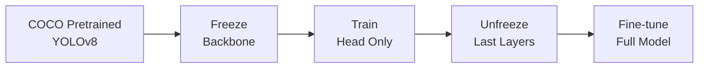

# Model Eğitimi ve Dataset

## Veri Kaynakları

Bu projede kullanılan modeller, aşağıdaki açık kaynak veri setleri üzerinde eğitilmiştir:

### SoccerNet

!!! info "SoccerNet Dataset"
    SoccerNet, futbol video analizi için en kapsamlı açık kaynak veri setidir.
    
    - **500+** maç videosu
    - **300K+** annotated frame
    - Action spotting, tracking, calibration görevleri

**Kullanım Alanı:** Saha keypoint tespiti modeli

### Roboflow Football Dataset

| Dataset | Görüntü Sayısı | Sınıflar |
|---------|----------------|----------|
| Football Players Detection | 12,000 | player, goalkeeper, referee |
| Football Ball Detection | 8,500 | ball |

---

## YOLOv8 Eğitim Pipeline

### 1. Veri Hazırlama

```yaml
# data.yaml
path: /data/football
train: images/train
val: images/val

names:
  0: player
  1: goalkeeper
  2: ball
  3: referee
```

### 2. Model Eğitimi

```python
from ultralytics import YOLO

# Pretrained model yükle
model = YOLO('yolov8m.pt')

# Fine-tune
results = model.train(
    data='data.yaml',
    epochs=100,
    imgsz=1280,
    batch=16,
    device='cuda',
    
    # Augmentation
    augment=True,
    mosaic=1.0,
    mixup=0.1,
    
    # Learning Rate
    lr0=0.01,
    lrf=0.01,
    
    # Early Stopping
    patience=20
)
```

### 3. Pose Model (Saha Keypoints)

```python
# YOLOv8-Pose için özel konfigürasyon
model = YOLO('yolov8m-pose.pt')

results = model.train(
    data='field_keypoints.yaml',
    epochs=150,
    imgsz=1280,
    
    # Pose-specific
    kpt_shape=[32, 2],  # 32 nokta, 2D koordinat
)
```

---

## Data Augmentation Stratejisi

### Geometric Transforms

```python
augmentations = {
    'hsv_h': 0.015,      # Hue shift
    'hsv_s': 0.7,        # Saturation
    'hsv_v': 0.4,        # Value
    'degrees': 5.0,      # Rotation
    'translate': 0.1,    # Translation
    'scale': 0.5,        # Scale
    'shear': 2.0,        # Shear
    'perspective': 0.001, # Perspective
    'flipud': 0.0,       # Vertical flip (kapalı)
    'fliplr': 0.5,       # Horizontal flip
}
```

!!! warning "Dikkat: Flip Augmentation"
    Saha keypoint modeli için **vertical flip kapatılmalıdır**. Aksi halde sol-sağ simetri bozulur ve keypoint eşleşmeleri yanlış olur.

### Mosaic & MixUp

```
┌─────────┬─────────┐
│ Image 1 │ Image 2 │
├─────────┼─────────┤    →    Combined Training Sample
│ Image 3 │ Image 4 │
└─────────┴─────────┘
```

Mosaic augmentation, model'in:
- Farklı ölçeklerde nesneleri öğrenmesini sağlar
- Küçük batch size ile çeşitlilik kazandırır
- Batch normalization istatistiklerini iyileştirir

---

## Transfer Learning Yaklaşımı

### Neden Transfer Learning?

1. **Veri Kıtlığı:** Futbol spesifik veri sınırlı
2. **Hesaplama Maliyeti:** Sıfırdan eğitim pahalı
3. **Feature Reuse:** Genel görsel özellikler transfer edilebilir

### Strateji



```python
# Aşama 1: Sadece head eğit
model = YOLO('yolov8m.pt')
for param in model.model.model[:10].parameters():
    param.requires_grad = False

model.train(epochs=50)

# Aşama 2: Tüm modeli fine-tune
for param in model.model.parameters():
    param.requires_grad = True

model.train(epochs=50, lr0=0.001)  # Düşük LR
```

---

## Değerlendirme Metrikleri

### Object Detection

| Metrik | Formül | Değer |
|--------|--------|-------|
| mAP@0.5 | Mean Average Precision @ IoU 0.5 | **0.912** |
| mAP@0.5:0.95 | Mean AP across IoU thresholds | **0.743** |
| Precision | TP / (TP + FP) | **0.891** |
| Recall | TP / (TP + FN) | **0.867** |

### Keypoint Detection

| Metrik | Açıklama | Değer |
|--------|----------|-------|
| OKS | Object Keypoint Similarity | **0.834** |
| PCK@0.1 | Percentage of Correct Keypoints | **0.891** |

### Confusion Matrix

```
              Predicted
              Player  GK   Referee
Actual Player   892    12     8
       GK        15   156     3
       Referee    7     2   189
```

---

## Model Export

### ONNX Export

```python
model.export(format='onnx', dynamic=True, simplify=True)
```

### TensorRT (Production)

```python
model.export(format='engine', half=True, device=0)
```

TensorRT, NVIDIA GPU'larda **2-3x** hızlanma sağlar.

---

## Bilinen Sınırlamalar

!!! warning "Edge Cases"
    
    1. **Kalabalık Alanlar:** Çakışan oyuncularda tespit düşer
    2. **Düşük Işık:** Gece maçlarında güven skorları azalır
    3. **Uzak Kamera:** Geniş açı çekimlerde top kaybedilebilir
    4. **Hızlı Hareket:** Motion blur'da tespit zorlaşır

### Çözüm Önerileri

| Problem | Çözüm |
|---------|-------|
| Çakışma | IoU-based re-verification |
| Düşük ışık | Histogram equalization |
| Uzak çekim | Multi-scale inference |
| Motion blur | Deblur preprocessing |

---

## Sonraki Bölümler

- [Homografi Dönüşümü](../geometry/homography.md)
- [Koordinat Sistemleri](../geometry/coordinates.md)
