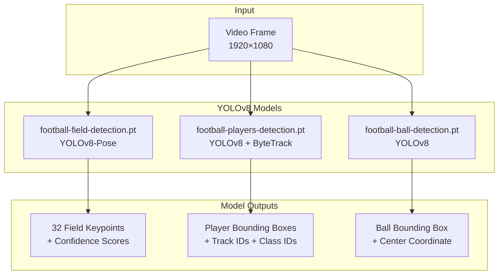
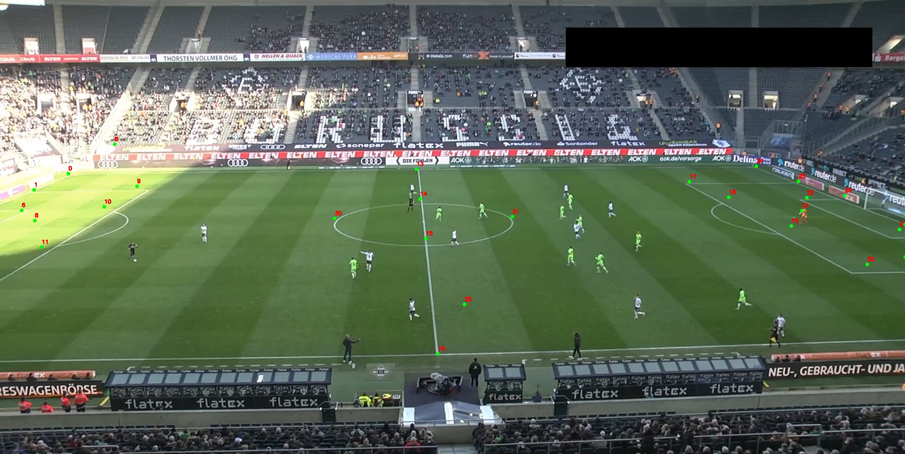

# YOLOv8 Pipeline

## Genel Bakış

Bu sistem, **üç ayrı YOLOv8 modeli** kullanarak saha, oyuncu ve top tespiti yapar. Her model özel bir görev için optimize edilmiştir.



---

## Model 1: Saha Keypoint Tespiti

### Model Detayları

| Özellik | Değer |
|---------|-------|
| **Mimari** | YOLOv8-Pose |
| **Görev** | Keypoint Detection |
| **Çıktı** | 32 nokta + güven skorları |
| **Güven Eşiği** | 0.5 |

### 32 FIFA Keypoint Standardı

Model, SoccerNet/FIFA standardına uygun 32 anahtar noktayı tespit eder. Aşağıdaki görsel, gerçek bir maç görüntüsü üzerinde tespit edilen keypoint'leri göstermektedir:



!!! info "Keypoint Renk Kodları"
    - **Yeşil noktalar:** Yüksek güvenle tespit edilen keypoint'ler (conf > 0.6)
    - **Kırmızı numaralar:** Keypoint ID'leri (0-31 arası)
    - Görüntüde ceza sahası köşeleri, orta saha çizgisi ve kale alanı noktaları net şekilde tespit edilmiştir.

### Keypoint → Metre Mapping

```python
PITCH_KEYPOINTS = {
    0: [0, 0],           # Sol üst köşe
    5: [0, 68],          # Sol alt köşe
    13: [52.5, 0],       # Orta saha (üst)
    16: [52.5, 68],      # Orta saha (alt)
    24: [105, 0],        # Sağ üst köşe
    29: [105, 68],       # Sağ alt köşe
    # Ceza sahası noktaları
    9: [16.5, 13.85],    # Sol ceza sahası üst
    12: [16.5, 54.15],   # Sol ceza sahası alt
    17: [88.5, 13.85],   # Sağ ceza sahası üst
    20: [88.5, 54.15],   # Sağ ceza sahası alt
    # Kale alanı noktaları
    6: [5.5, 24.85],
    7: [5.5, 43.15],
    22: [99.5, 24.85],
    23: [99.5, 43.15],
    # ... toplam 32 nokta
}
```

### Inference Kodu

```python
def predict_field(self, frame) -> Any:
    if self.field_model is None: 
        return None
    
    return self.field_model.predict(
        frame, 
        verbose=False, 
        device=self.device, 
        conf=0.5,           # Minimum güven
        half=True           # FP16 precision
    )[0]
```

### Çıktı Kullanımı

```python
result = engine.predict_field(frame)

# Keypoint koordinatları (piksel)
keypoints = result.keypoints.xy[0].cpu().numpy()  # Shape: (32, 2)

# Güven skorları
confidences = result.keypoints.conf[0].cpu().numpy()  # Shape: (32,)

# Yüksek güvenli noktaları filtrele
valid_mask = confidences > 0.6
valid_keypoints = keypoints[valid_mask]
```

---

## Model 2: Oyuncu Tespiti ve Takibi

### Model Detayları

| Özellik | Değer |
|---------|-------|
| **Mimari** | YOLOv8 |
| **Görev** | Object Detection + Tracking |
| **Tracker** | ByteTrack |
| **Sınıflar** | player(0), goalkeeper(1), referee(3) |
| **Güven Eşiği** | 0.4 |

### ByteTrack Entegrasyonu

!!! info "Neden Tracking?"
    Ofsayt tespiti için her oyuncunun **frame'ler arası tutarlı ID**'ye sahip olması kritiktir. Tracking olmadan:
    
    - Takım tahminleri her frame'de sıfırdan yapılır
    - Temporal voting çalışmaz
    - Oyuncu hareketleri takip edilemez

```python
def predict_players(self, frame, conf: float = 0.4) -> Any:
    if self.player_model is None: 
        return None
    
    # Track modunda çalıştır - persist=True ID korunumu sağlar
    return self.player_model.track(
        frame, 
        persist=True,       # ID'leri koru
        verbose=False, 
        device=self.device, 
        conf=conf,
        half=True
    )[0]
```

### Çıktı Yapısı

```python
result = engine.predict_players(frame)

# Bounding box'lar [x1, y1, x2, y2]
boxes = result.boxes.xyxy.int().cpu().tolist()

# Track ID'leri (ByteTrack tarafından atanır)
track_ids = result.boxes.id.int().cpu().tolist()

# Sınıf ID'leri
class_ids = result.boxes.cls.int().cpu().tolist()
# 0 = player, 1 = goalkeeper, 3 = referee
```

### Hakem Filtreleme

```python
for tid, cid, box in zip(track_ids, class_ids, boxes):
    if cid == 3:  # Hakem
        continue  # Ofsayt hesabına dahil etme
```

---

## Model 3: Top Tespiti

### Model Detayları

| Özellik | Değer |
|---------|-------|
| **Mimari** | YOLOv8 |
| **Görev** | Object Detection |
| **Güven Eşiği** | 0.3 (düşük, çünkü top küçük) |
| **Özel Zorluk** | Küçük nesne, hızlı hareket |

### Tasarım Kararı: Track vs Detect

!!! warning "Neden Tracking Kullanmıyoruz?"
    Top için **tracking yerine detection** tercih edilir çünkü:
    
    1. Top çok hızlı hareket eder → tracker kaybedebilir
    2. Top sık sık görüntüden çıkar → ID karışır
    3. Her frame'de tek top olduğu varsayılır → ID'ye gerek yok

```python
def predict_ball(self, frame) -> Any:
    if self.ball_model is None: 
        return None
    
    # Predict modunda çalıştır (track değil)
    return self.ball_model.predict(
        frame, 
        verbose=False, 
        device=self.device, 
        conf=0.3,      # Düşük eşik
        half=True
    )[0]
```

### Top Merkezi Hesaplama

```python
if len(b_res.boxes) > 0:
    bx = b_res.boxes[0].xyxy[0].cpu().numpy()
    
    # Bounding box merkezini al
    ball_center_pixel = np.array([
        (bx[0] + bx[2]) / 2,  # X merkezi
        bx[3]                  # Y alt (ayak seviyesi)
    ])
    
    # Metre koordinatına dönüştür
    ball_meter = geometry.pixel_to_pitch(ball_center_pixel)
```

!!! note "Neden `bx[3]` (Alt Kenar)?"
    Top için Y koordinatı olarak **alt kenar** kullanılır. Bunun nedeni, homografi dönüşümünün **zemin düzleminde** çalışmasıdır. Topun zemine temas noktası, metrik koordinat için en doğru referanstır.

---

## FP16 (Half Precision) Optimizasyonu

Tüm modeller **FP16 modunda** çalıştırılır:

```python
model.predict(..., half=True)
```

### Faydaları

| Metrik | FP32 | FP16 | İyileşme |
|--------|------|------|----------|
| VRAM Kullanımı | ~6 GB | ~3 GB | **%50** |
| Inference Süresi | 42ms | 28ms | **%33** |
| Accuracy Loss | - | ~0.1% | Kabul edilebilir |


## Hata Yönetimi (Error Handling)

### Model Yükleme Hatası

```python
def _load_model(self, path: Optional[str], task: str) -> Optional[YOLO]:
    if not path or path == '':
        return None
    
    try:
        model = YOLO(path, task=task)
        model.to(self.device)
        return model
    except Exception as e:
        print(f"[ERROR] Model yüklenemedi ({path}): {e}")
        return None
```

### Tespit Yoksa

```python
# Saha tespiti başarısızsa homografi güncellenmez
if f_res.keypoints is not None:
    geometry.solve_from_model(...)

# Top bulunamazsa None döner
ball_m = None
if len(b_res.boxes) > 0:
    # ...
```

---

## Sonraki Bölümler

- [Model Eğitimi](model-training.md) - Custom dataset ve fine-tuning
- [Homografi Matematiği](../geometry/homography.md) - Keypoint'lerden dönüşüm
