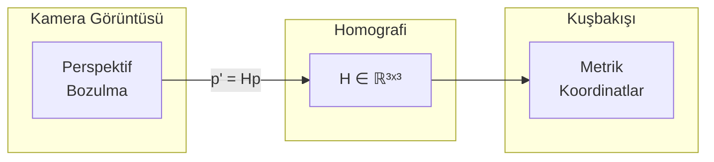
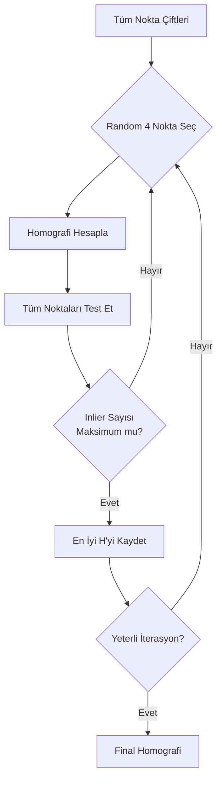

# Homografi ve Perspektif Dönüşümü

## Temel Kavram

**Homografi**, bir düzlemdeki noktaları başka bir düzleme eşleyen **projektif dönüşümdür**. Futbol sahasında:

- **Kaynak Düzlem:** Kamera görüntüsü (piksel)
- **Hedef Düzlem:** Kuşbakışı saha görünümü (metre)



---

## Matematiksel Formülasyon

### Homografi Matrisi

Homografi, 3×3 boyutunda bir matris ile ifade edilir:

$$
\mathbf{H} = \begin{bmatrix} 
h_{11} & h_{12} & h_{13} \\
h_{21} & h_{22} & h_{23} \\
h_{31} & h_{32} & h_{33}
\end{bmatrix}
$$

### Dönüşüm Denklemi

Piksel koordinatı $(u, v)$'dan metre koordinatı $(x, y)$'ye dönüşüm:

$$
\begin{bmatrix} x' \\ y' \\ w' \end{bmatrix} = \mathbf{H} \cdot \begin{bmatrix} u \\ v \\ 1 \end{bmatrix}
$$

**Normalleştirme:**

$$
x = \frac{x'}{w'}, \quad y = \frac{y'}{w'}
$$

!!! note "Homojen Koordinatlar"
    $w'$ bileşeni **projeksiyon faktörüdür**. Normalleştirme, perspektif etkisini ortadan kaldırır.

### Ters Dönüşüm

Metre → Piksel dönüşümü için ters matris kullanılır:

$$
\begin{bmatrix} u' \\ v' \\ w' \end{bmatrix} = \mathbf{H}^{-1} \cdot \begin{bmatrix} x \\ y \\ 1 \end{bmatrix}
$$

---

## DLT (Direct Linear Transform)

Homografi matrisini hesaplamak için en az **4 eşleşen nokta çifti** gerekir.

### Nokta Eşleşmeleri

```
Piksel (u, v)     →     Saha (x, y)
───────────────────────────────────
(120, 80)         →     (0, 0)        # Sol üst köşe
(1800, 80)        →     (105, 0)      # Sağ üst köşe
(1850, 1000)      →     (105, 68)     # Sağ alt köşe
(70, 1000)        →     (0, 68)       # Sol alt köşe
```

### DLT Algoritması

Her nokta çifti için iki denklem:

$$
\begin{align}
-u \cdot h_{31} \cdot x - u \cdot h_{32} \cdot y - u \cdot h_{33} + h_{11} \cdot x + h_{12} \cdot y + h_{13} &= 0 \\
-v \cdot h_{31} \cdot x - v \cdot h_{32} \cdot y - v \cdot h_{33} + h_{21} \cdot x + h_{22} \cdot y + h_{23} &= 0
\end{align}
$$

4 nokta → 8 denklem → 8 bilinmeyen (h₃₃ = 1 normalize edilir)

---

## RANSAC ile Robust Homografi

### Problem: Outlier Keypoints

Model her zaman doğru keypoint tespit etmez. Yanlış eşleşmeler homografiyi bozar.

```
✓ Doğru: (120, 80) → (0, 0)
✓ Doğru: (1800, 80) → (105, 0)
✗ Yanlış: (500, 300) → (52.5, 0)  ← OUTLIER
✓ Doğru: (1850, 1000) → (105, 68)
```

### RANSAC Algoritması

**RANSAC (Random Sample Consensus)**, outlier'ları otomatik olarak eler:



### OpenCV Implementasyonu

```python
def calculate_robust_h(self, src_pts, dst_pts):
    """RANSAC ile gürültüyü temizler ve matrisi doğrular."""
    
    # RANSAC ile homografi hesapla
    H, status = cv2.findHomography(
        src_pts, 
        dst_pts, 
        cv2.RANSAC,     # Metot
        3.0              # Reproj. error threshold (piksel)
    )
    
    if H is None: 
        return None

    # Geometrik Doğrulama
    det = np.linalg.det(H[:2, :2])
    if abs(det) < 1e-6:  # Singüler matris
        return None
    
    return H
```

### RANSAC Parametreleri

| Parametre | Değer | Açıklama |
|-----------|-------|----------|
| `method` | RANSAC | Robust estimation |
| `ransacReprojThreshold` | 3.0 | Max reprojection error (px) |
| `maxIters` | 2000 | Maximum iterations |
| `confidence` | 0.995 | Desired success probability |

---

## Geometrik Doğrulama

Homografi matrisinin geçerliliği kontrol edilmelidir:

### 1. Determinant Kontrolü

$$
\det(\mathbf{H}_{2 \times 2}) = h_{11} \cdot h_{22} - h_{12} \cdot h_{21}
$$

- $|\det| \approx 0$ → Matris singüler, geçersiz
- $\det < 0$ → Yansıma var, muhtemelen hatalı

```python
det = np.linalg.det(H[:2, :2])
if abs(det) < 1e-6:
    return None  # Geçersiz matris
```

### 2. Condition Number

$$
\kappa(\mathbf{H}) = \|\mathbf{H}\| \cdot \|\mathbf{H}^{-1}\|
$$

Yüksek condition number → Sayısal kararsızlık

```python
cond = np.linalg.cond(H)
if cond > 1e6:
    print("[WARNING] Ill-conditioned homography")
```

---

## Görsel Doğrulama: Grid Testi

Homografi matrisinin doğruluğunu test etmenin en etkili yolu, **metrik koordinatlarda düzenli bir grid** oluşturup bunu görüntüye yansıtmaktır.

### Test Yöntemi

1. Metrik koordinatlarda sabit aralıklı çizgiler tanımla (her 10 metre)
2. `pitch_to_pixel()` ile piksel koordinatlarına dönüştür
3. Görüntü üzerine çiz ve perspektif doğruluğunu gözlemle


!!! success "Doğrulama Sonucu"
    Yukarıdaki görüntüde:
    
    - **Mavi dikey çizgiler:** Her 10 metrede bir X ekseni çizgileri (0m, 10m, 20m, ... 105m)
    - **Mavi yatay çizgiler:** Sabit Y koordinatlarında çizgiler
    - **Yeşil noktalar:** Tespit edilen keypoint'ler
    - **"STATUS: NEW MATRIX":** Homografi matrisinin yeni hesaplandığını gösterir
    
    Çizgilerin saha çizgileriyle **paralel ve hizalı** olması, homografi dönüşümünün **doğru çalıştığını** kanıtlar.


## Kod Implementasyonu

### GeometryEngine Sınıfı

```python
class GeometryEngine:
    def __init__(self):
        self.PITCH_WIDTH = 105.0   # FIFA standart (m)
        self.PITCH_HEIGHT = 68.0   # FIFA standart (m)
        self.homography_matrix = None
        self.h_inv = None
        
        # 32 FIFA keypoint mapping
        self.PITCH_KEYPOINTS = {
            0: [0, 0],      # Sol üst köşe
            5: [0, 68],     # Sol alt köşe
            13: [52.5, 0],  # Orta saha üst
            # ... 32 nokta
        }

    def solve_from_model(self, kpts, confs) -> bool:
        """Gelişmiş Çözücü: Confidence filtering ve Outlier reddetme içerir."""
        src_pts, dst_pts = [], []
        
        CONF_THRESHOLD = 0.6
        
        for idx, (kp, conf) in enumerate(zip(kpts, confs)):
            if conf >= CONF_THRESHOLD and idx in self.PITCH_KEYPOINTS:
                src_pts.append([kp[0], kp[1]])
                dst_pts.append(self.PITCH_KEYPOINTS[idx])
        
        if len(src_pts) >= 6:  # Minimum 6 nokta
            new_h = self.calculate_robust_h(
                np.array(src_pts), 
                np.array(dst_pts)
            )
            if new_h is not None:
                self.homography_matrix = new_h
                self.h_inv = np.linalg.inv(new_h)
                return True
        return False
```

### Piksel → Metre Dönüşümü

```python
def pixel_to_pitch(self, points: np.ndarray) -> np.ndarray:
    """
    Piksel koordinatlarını metre cinsine dönüştürür.
    
    Args:
        points: Shape (N, 2) - [[u1, v1], [u2, v2], ...]
        
    Returns:
        Shape (N, 2) - [[x1, y1], [x2, y2], ...] (metre)
    """
    if self.homography_matrix is None: 
        return np.array([])
    
    # Homojen koordinatlara çevir
    ones = np.ones((len(points), 1))
    points_homo = np.concatenate([points, ones], axis=1)
    
    # Dönüşüm uygula
    transformed = (self.homography_matrix @ points_homo.T).T
    
    # Normalleştir
    return transformed[:, :2] / transformed[:, 2:3]
```

### Metre → Piksel Dönüşümü

```python
def pitch_to_pixel(self, points: np.ndarray) -> np.ndarray:
    """Metre koordinatlarını piksele dönüştürür."""
    if self.h_inv is None: 
        return np.array([])
        
    points_homo = np.concatenate([points, np.ones((len(points), 1))], axis=1)
    transformed = (self.h_inv @ points_homo.T).T
    return transformed[:, :2] / transformed[:, 2:3]
```

---

## Ofsayt Çizgisi Çizimi

Ofsayt çizgisi, **sabit X koordinatında dikey bir çizgidir**:

```python
def get_offside_line(self, offside_x_metric: float) -> List[Tuple[int, int]]:
    """
    Ofsayt X koordinatını görüntüdeki perspektif çizgiye çevirir.
    
    Args:
        offside_x_metric: Ofsayt çizgisi X koordinatı (metre)
        
    Returns:
        [(x1, y1), (x2, y2)] - Çizginin piksel koordinatları
    """
    # Sahadaki dikey çizgi (X sabit, Y: 0 → 68)
    pitch_line = np.array([
        [offside_x_metric, 0],
        [offside_x_metric, self.PITCH_HEIGHT]
    ], dtype=np.float32)
    
    # Piksele dönüştür
    pixel_line = self.pitch_to_pixel(pitch_line)
    
    if len(pixel_line) < 2: 
        return []
    
    return [(int(p[0]), int(p[1])) for p in pixel_line]
```

### Görselleştirme

```python
pts = geometry.get_offside_line(68.0)  # X = 35 metre

if len(pts) == 2:
    cv2.line(frame, pts[0], pts[1], (0, 255, 255), 2)
```

---

## Hata Kaynakları ve Çözümler

| Hata | Neden | Çözüm |
|------|-------|-------|
| Titreyen çizgi | Frame-to-frame keypoint değişimi | EMA smoothing |
| Kayık çizgi | Yetersiz keypoint | Minimum 6 nokta şartı |
| Çizgi yok | Homografi hesaplanamadı | Önceki matrisi koru |
| Yanlış pozisyon | Outlier keypoint | RANSAC threshold ayarla |

### EMA Smoothing

```python
# Ani sıçramaları önlemek için
smoothed_line = alpha * raw_line + (1 - alpha) * smoothed_line
# alpha = 0.15 (yavaş adaptasyon)
```

---

## Sonraki Bölümler

- [Koordinat Sistemleri](coordinates.md)
- [Takım Sınıflandırma](../classification/siglip.md)
