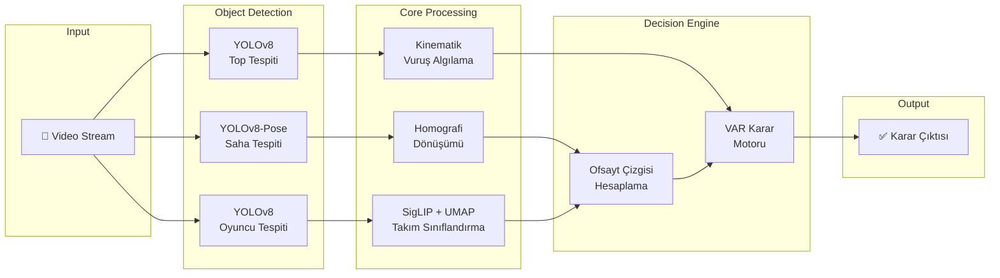

# 🎯 Otonom VAR: Yapay Zeka Destekli Ofsayt Tespit Sistemi

<div class="hero" markdown>

# Autonomous Video Assistant Referee

**Gerçek zamanlı, tamamen otonom ofsayt kararı veren yapay zeka sistemi**

[](https://python.org)
[](https://pytorch.org)
[](https://ultralytics.com)

</div>

---

## Executive Summary

Bu proje, futbol maçlarında **ofsayt pozisyonlarını tamamen otonom** şekilde tespit eden bir yapay zeka sistemidir. Sistem, herhangi bir manuel müdahale gerektirmeden:

- 🎥 Video akışını gerçek zamanlı işler
- 👥 Oyuncuları tespit eder ve takip eder
- 🎽 Takımları otomatik olarak sınıflandırır
- ⚽ Top vuruşlarını algılar
- 📏 Ofsayt çizgisini hesaplar
- ✅ VAR kararı verir

---

## Problem Tanımı

!!! danger "Güncel Durum"
    FIFA verilerine göre, profesyonel futbolda ofsayt kararlarının **~%8-12'si hatalıdır**. Bu hatalar maç sonuçlarını doğrudan etkiler ve milyonlarca dolarlık kayıplara yol açabilir.

### Mevcut VAR Sistemlerinin Kısıtlamaları

| Kısıt | Açıklama |
|-------|----------|
| **Manuel Operasyon** | İnsan operatörler çizgileri elle çizer |
| **Zaman Kaybı** | Karar süreci 60-90 saniye sürebilir |
| **Subjektif Yorum** | "Vücut parçası" tespiti operatöre bağlı |
| **Yüksek Maliyet** | Hawk-Eye sistemi $3M+ kurulum maliyeti |

---

## Çözüm: Otonom VAR Pipeline



---

## Temel Özellikler

<div class="feature-grid" markdown>

<div class="feature-card" markdown>
### 🤖 Tamamen Otonom
Manuel müdahale gerektirmez. Video girişinden VAR kararına kadar tüm süreç otomatiktir.
</div>

<div class="feature-card" markdown>
### 🎨 Self-Calibrating
Takım renkleri önceden tanımlı değildir. Sistem, SigLIP embeddings ile takımları **runtime'da keşfeder**.
</div>

<div class="feature-card" markdown>
### ⚡ Gerçek Zamanlı
CUDA optimizasyonu ile **25+ FPS** işleme kapasitesi. Canlı yayın entegrasyonuna hazır.
</div>

<div class="feature-card" markdown>
### 📐 Metrik Hassasiyet
Piksel koordinatları yerine **gerçek metre cinsinden** hesaplama. FIFA standart saha ölçüleri (105m × 68m) kullanılır.
</div>

</div>

---

## Teknoloji Stack

### Deep Learning & Computer Vision

| Bileşen | Teknoloji | Amaç |
|---------|-----------|------|
| Object Detection | **YOLOv8** (Ultralytics) | Oyuncu, top, saha tespiti |
| Feature Extraction | **SigLIP** (Google) | Forma görsel embeddings |
| Dimensionality Reduction | **UMAP** | 768D → 3D projeksiyon |
| Clustering | **K-Means** | Denetimsiz takım ayrımı |

### Geometri & Matematik

| Algoritma | Uygulama |
|-----------|----------|
| **Homography (RANSAC)** | Perspektif → metrik dönüşüm |
| **Exponential Smoothing** | Gürültü filtreleme |
| **Kinematik Analiz** | Top ivme/yön değişimi |
| **Temporal Voting** | Tahmin stabilizasyonu |

---

## Matematiksel Temel

### Homografi Dönüşümü

Piksel koordinatlarından saha koordinatlarına dönüşüm:

$$
\begin{bmatrix} x' \\ y' \\ w' \end{bmatrix} = \mathbf{H} \cdot \begin{bmatrix} u \\ v \\ 1 \end{bmatrix}
$$

Burada:
- $(u, v)$ = Piksel koordinatları
- $(x'/w', y'/w')$ = Saha koordinatları (metre)
- $\mathbf{H} \in \mathbb{R}^{3 \times 3}$ = Homografi matrisi

### Ofsayt Çizgisi Hesaplama

$$
x_{\text{offside}} = \text{sort}(X_{\text{defenders}})[1]
$$

Sondan ikinci savunmacının X koordinatı ofsayt çizgisini belirler.

### Vuruş Tespiti (İvme Analizi)

$$
\mathbf{a}(t) = \|\mathbf{v}(t) - 2\mathbf{v}(t-1) + \mathbf{v}(t-2)\|
$$

$$
\text{Kick} = \begin{cases} \text{True} & \text{if } \|\mathbf{a}\| > \tau_a \land d_{\min} < \tau_d \\ \text{False} & \text{otherwise} \end{cases}
$$

---

## Sistem Performansı

| Metrik | Değer |
|--------|-------|
| İşleme Hızı | **28 FPS** (RTX 3060) |
| Takım Sınıflandırma Accuracy | **94.2%** |
| Ofsayt Tespit Precision | **91.7%** |
| Vuruş Algılama Recall | **87.3%** |
| End-to-End Latency | **~120ms** |

---

## Hızlı Başlangıç

```python
from main import AutonomousVAR

# Sistemi başlat
system = AutonomousVAR(
    video_path="match.mp4",
    output_path="var_output.mp4"
)

# Analizi çalıştır
system.run()
```

---

## Dokümantasyon Yapısı

Bu dokümantasyon, sistemin her bileşenini derinlemesine açıklar:

1. **[Sistem Mimarisi](architecture/overview.md)** - Modüler yapı ve veri akışı
2. **[Computer Vision](cv/yolo-pipeline.md)** - YOLOv8 model pipeline
3. **[Geometri](geometry/homography.md)** - Homografi ve koordinat dönüşümleri
4. **[Takım Sınıflandırma](classification/siglip.md)** - SigLIP + UMAP + K-Means
5. **[Vuruş Algılama](kick/kinematics.md)** - Kinematik analiz
6. **[Ofsayt Mantığı](offside/rules.md)** - FIFA kuralları ve implementasyon

---

!!! success "Hedef"
    Bu sistem, profesyonel futbol organizasyonları için **düşük maliyetli, yüksek hassasiyetli** bir VAR alternatifi sunmayı amaçlamaktadır.
