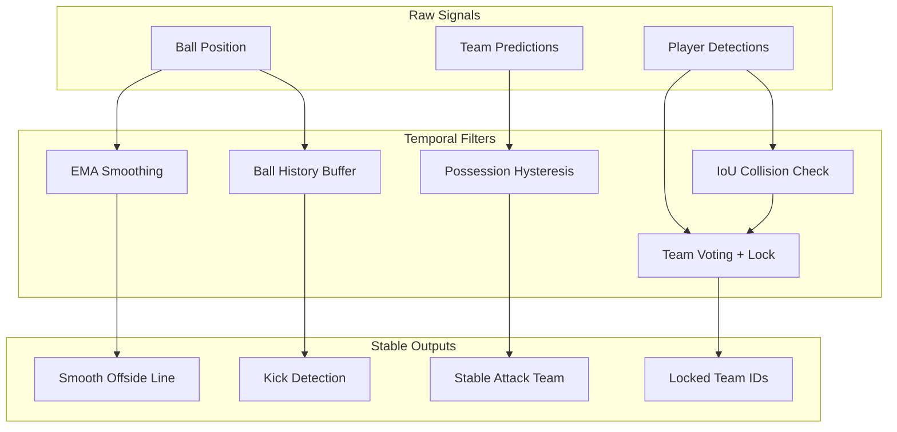

# Temporal Filtering

## Gürültü Kaynakları

Real-time video analizinde birçok gürültü kaynağı vardır:

| Kaynak | Etki |
|--------|------|
| **Tespit hatası** | Top/oyuncu yanlış pozisyonda |
| **Tracking kaybı** | ID atlama veya kayıp |
| **Motion blur** | Hızlı harekette belirsizlik |
| **Oklüzyon** | Nesneler birbirini kapatır |
| **Kamera hareketi** | Homografi değişimi |

Bu gürültüler **frame-to-frame tutarsızlıklara** yol açar.

---

## Exponential Moving Average (EMA)

### Ofsayt Çizgisi Yumuşatma

Ham ofsayt çizgisi pozisyonu titrer. EMA ile yumuşatılır:

$$
\hat{x}_t = \alpha \cdot x_t + (1-\alpha) \cdot \hat{x}_{t-1}
$$

Burada:
- $x_t$: Raw pozisyon (frame t)
- $\hat{x}_t$: Smoothed pozisyon
- $\alpha$: Yumuşatma faktörü (0-1)

```python
class OffsideLogic:
    def __init__(self):
        self.alpha = 0.15  # Yavaş adaptasyon
        self.smoothed_line_x = None
        self.raw_line_x = None

    def calculate_offside_line(self, players):
        # ... raw_line_x hesapla ...
        
        if self.smoothed_line_x is None:
            self.smoothed_line_x = self.raw_line_x
        else:
            self.smoothed_line_x = (
                self.alpha * self.raw_line_x + 
                (1 - self.alpha) * self.smoothed_line_x
            )
        
        return self.smoothed_line_x
```

### Alpha Değeri Seçimi

| Alpha | Davranış | Kullanım |
|-------|----------|----------|
| 0.05 | Çok yavaş adaptasyon | Stabil sahne |
| **0.15** | Dengeli | **Genel kullanım** |
| 0.5 | Hızlı adaptasyon | Dinamik sahne |
| 1.0 | Filtreleme yok | Debug |

### Görsel Karşılaştırma

```
Raw Signal:     ╱╲╱╲╱╲╱╲╱╲╱╲    (Titrek)
                
EMA (α=0.15):   ───────────      (Düz)
```

---

## Lag Compensation

### Problem: EMA Gecikme Yaratır

EMA yumuşatma, **doğal bir gecikme** ekler:

```
Raw:        ──────╱──────
                 ↑
             Değişim anı (t=0)
             
Smoothed:   ──────────╱──
                     ↑
              Gecikmiş tepki (t=2)
```

### Ofsayt Kararında Gecikme Tehlikeli

Vuruş anında **raw pozisyon** kullanılmalı, çünkü:
- EMA çizgisi henüz gerçek pozisyona ulaşmamış olabilir
- Santimetre hassasiyetinde karar vermek gerekir

### Çözüm: Dual-Line Yaklaşımı

```python
class OffsideLogic:
    def calculate_offside_line(self, players):
        # ...
        
        # Raw: Karar için kullanılır
        self.raw_line_x = defenders[1]
        
        # Smoothed: Sadece görselleştirme için
        self.smoothed_line_x = (
            self.alpha * self.raw_line_x + 
            (1 - self.alpha) * self.smoothed_line_x
        )
        
        return self.smoothed_line_x  # UI için
```

```python
# main.py - Karar anında
if is_kick:
    decision_line = self.offside_logic.raw_line_x  # ← Raw kullan!
    result = self.final_logic.process_decision(
        attackers, decision_line, direction
    )
```

---

## Ball History Buffer

### Deque Yapısı

Son N frame'deki top pozisyonlarını tutar:

```python
from collections import deque

ball_history = deque(maxlen=10)

# Her frame'de
ball_history.append((x, y, frame_idx))

# Otomatik olarak eski veriler düşer
# [f1, f2, f3, f4, f5, f6, f7, f8, f9, f10]
#                                     ↑ yeni
# [f2, f3, f4, f5, f6, f7, f8, f9, f10, f11]
#  ↑ düşer                            ↑ yeni
```

### Neden 10 Frame?

| Buffer Size | Avantaj | Dezavantaj |
|-------------|---------|------------|
| 3 | Hızlı tepki | Gürültüye duyarlı |
| **10** | Dengeli | **Genel kullanım** |
| 30 | Çok stabil | Eski veri etkisi |

10 frame ≈ 0.4 saniye (25 FPS'te) → Yeterli bağlam.

---

## Possession Hysteresis

### Problem: Sık Takım Değişimi

Topa en yakın oyuncu sürekli değişiyorsa, atak takımı da sürekli değişir:

```
Frame 1: T0 closest → Attack: T0
Frame 2: T1 closest → Attack: T1  ← Gereksiz değişim
Frame 3: T0 closest → Attack: T0  ← Gereksiz değişim
```

### Çözüm: Hysteresis Threshold

```python
class OffsideLogic:
    def __init__(self):
        self.possession_history = deque(maxlen=50)  # 2 saniye
        self.stability_threshold = 0.75  # %75 baskınlık

    def update_attacking_team(self, players, ball_coord):
        # ... en yakın takımı bul ...
        
        self.possession_history.append(closest_team)
        
        counts = Counter(self.possession_history)
        most_common, count = counts.most_common(1)[0]
        
        # Hysteresis: %75 baskınlık olmadan değiştirme
        ratio = count / len(self.possession_history)
        if ratio > self.stability_threshold:
            self.attacking_team_id = most_common
```

### Görsel

```
Possession History: [0,0,0,1,0,0,0,0,1,0,0,0,0,0,0,...]
                            ↑       ↑
                         Noise   Noise

T0 Count: 45/50 = 90% > 75% → Attack = T0 (stabil)
```

---

## Team Prediction Voting

### Window-Based Voting

```python
class TemporalTeamVoter:
    def __init__(self):
        self.window_size = 15
        self.history = {}  # track_id → deque

    def vote(self, track_id, prediction):
        if track_id not in self.history:
            self.history[track_id] = deque(maxlen=15)
        
        self.history[track_id].append(prediction)
        
        # Majority voting
        counts = Counter(self.history[track_id])
        return counts.most_common(1)[0][0]
```

### Stability Locking

15 frame boyunca 12+ aynı tahmin → **Kalıcı kilit**:

```python
def vote(self, track_id, prediction):
    # ... voting ...
    
    most_common, count = counts.most_common(1)[0]
    
    # Stability check
    if (len(self.history[track_id]) == self.window_size and 
        count >= 12):
        self.stable_teams[track_id] = most_common
        # Artık predict çağrılmaz, direkt döner
```

---

## Collision-Based Unlock

### IoU Çakışma Tespiti

İki oyuncu çakıştığında tracking ID'leri karışabilir:

```python
def detect_collisions(self, tids, boxes, threshold=0.20):
    for i in range(len(tids)):
        for j in range(i + 1, len(tids)):
            b1, b2 = boxes[i], boxes[j]
            
            # Intersection
            x1 = max(b1[0], b2[0])
            y1 = max(b1[1], b2[1])
            x2 = min(b1[2], b2[2])
            y2 = min(b1[3], b2[3])
            
            if x2 < x1 or y2 < y1:
                continue
            
            inter_area = (x2 - x1) * (y2 - y1)
            min_area = min(
                (b1[2]-b1[0])*(b1[3]-b1[1]),
                (b2[2]-b2[0])*(b2[3]-b2[1])
            )
            
            # IoU kontrolü
            if inter_area / min_area > threshold:
                self.team_voter.unlock_id(tids[i])
                self.team_voter.unlock_id(tids[j])
```

### IoU Formülü

$$
\text{IoU} = \frac{|A \cap B|}{|A \cup B|} = \frac{\text{Intersection Area}}{\text{Union Area}}
$$

Basitleştirilmiş versiyon (minimum area bazlı):

$$
\text{Overlap Ratio} = \frac{\text{Intersection Area}}{\min(|A|, |B|)}
$$

---

## Filtering Pipeline Özeti



---

## Sonraki Bölümler

- [FIFA Ofsayt Kuralları](../offside/rules.md)
- [Karar Algoritması](../offside/algorithm.md)
