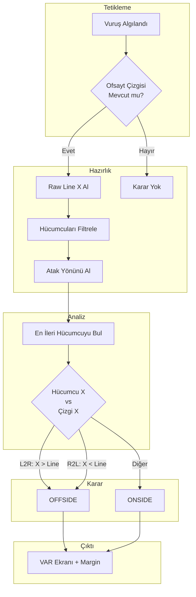

# Ofsayt Karar Algoritması

## Karar Pipeline'ı



---

## FinalDecisionLogic Sınıfı

### Kod İmplementasyonu

```python
class FinalDecisionLogic:
    def __init__(self):
        self.last_result = {}

    def process_decision(self, attackers: list, offside_line_x: float, direction: str) -> dict:
        """
        Ofsayt kararı verir.
        
        Args:
            attackers: Hücum eden takımın oyuncuları
            offside_line_x: Ofsayt çizgisi X koordinatı (metre)
            direction: "L2R" veya "R2L"
            
        Returns:
            {"is_offside": bool, "margin": float}
        """
        if not attackers or offside_line_x is None:
            return None
        
        # En ileri hücumcuyu bul
        attackers.sort(
            key=lambda p: p['coord'][0], 
            reverse=(direction == "L2R")
        )
        lead_attacker = attackers[0]
        
        # Fark hesapla
        diff = offside_line_x - lead_attacker['coord'][0]
        
        # Karar ver
        if direction == "L2R":
            is_offside = lead_attacker['coord'][0] > offside_line_x
        else:  # R2L
            is_offside = lead_attacker['coord'][0] < offside_line_x
        
        # Sonucu kaydet
        self.last_result = {
            "is_offside": is_offside,
            "margin": abs(diff)
        }
        
        return self.last_result
```

---

## Atak Yönü Belirleme

### Takım Centroid Yöntemi

```python
def update_attack_direction(self, players):
    # Her takımın X ortalaması
    t0_x = [p['coord'][0] for p in players if p['team'] == 0]
    t1_x = [p['coord'][0] for p in players if p['team'] == 1]
    
    if len(t0_x) < 3 or len(t1_x) < 3:
        return  # Yeterli veri yok
    
    centroid_0 = np.mean(t0_x)
    centroid_1 = np.mean(t1_x)
    
    # Hücum eden takımın centroid'i daha ileride
    if self.attacking_team_id == 0:
        self.attack_direction = "L2R" if centroid_0 < centroid_1 else "R2L"
    else:
        self.attack_direction = "L2R" if centroid_1 < centroid_0 else "R2L"
```

### Görsel

```
Team 0 Centroid: X = 35        Team 1 Centroid: X = 70
        ○                              ○
       ○○○                            ○○○
        ○                              ○
        
Attack Team = 0 → L2R (Sola doğru giden takım hücumda)
```

---

## Margin (Fark) Hesaplama

### Formül

$$
\text{margin} = |x_{\text{offside\_line}} - x_{\text{attacker}}|
$$

### Anlamı

| Margin | Anlam |
|--------|-------|
| < 0.1m | Çok yakın karar (VAR kritik) |
| 0.1-0.5m | Normal ofsayt |
| > 0.5m | Açık ofsayt |

### Görselleştirme

```python
def render_var_decision(self, frame, result, line_x):
    color = (0, 0, 255) if result['is_offside'] else (0, 255, 0)
    
    # Karar banner'ı
    cv2.rectangle(frame, (0, 0), (self.width, 150), (0, 0, 0), -1)
    
    text = f"VAR DECISION: {'OFFSIDE' if result['is_offside'] else 'ONSIDE'}"
    cv2.putText(frame, text, (50, 70), 0, 1.5, color, 4)
    
    # Margin göster
    margin_text = f"Margin: {result['margin']:.2f}m"
    cv2.putText(frame, margin_text, (50, 120), 0, 1.0, (255, 255, 255), 2)
    
    # Ofsayt çizgisi
    pts = self.geometry.get_offside_line(line_x)
    if len(pts) == 2:
        cv2.line(frame, pts[0], pts[1], color, 6)
```

---

## Sıralama ve En İleri Hücumcu

### L2R Atak (Soldan Sağa)

```python
# En büyük X = en ilerideki hücumcu
attackers.sort(key=lambda p: p['coord'][0], reverse=True)
lead = attackers[0]
```

```
Hücumcular X: [65, 58, 52]
Sıralı (desc): [65, 58, 52]
                ↑
           En ileri (X=65)
           
Ofsayt Çizgisi: X=62

65 > 62 → OFFSIDE
```

### R2L Atak (Sağdan Sola)

```python
# En küçük X = en ilerideki hücumcu
attackers.sort(key=lambda p: p['coord'][0])
lead = attackers[0]
```

```
Hücumcular X: [45, 52, 58]
Sıralı (asc): [45, 52, 58]
               ↑
          En ileri (X=45)
          
Ofsayt Çizgisi: X=48

45 < 48 → OFFSIDE
```

---

## Freeze Frame Mekanizması

### Neden Freeze?

VAR kararı **görsel olarak doğrulanabilir** olmalı. Karar anında frame dondurulur.

```python
class AutonomousVAR:
    def run(self):
        # ...
        
        if is_kick and smooth_line:
            # Kararı al
            decision_line = self.offside_logic.raw_line_x
            result = self.final_logic.process_decision(...)
            
            # Frame'i dondur
            self.freeze_frame = frame.copy()
            self.render_var_decision(self.freeze_frame, result, decision_line)
            
            # 3 saniye göster (25 FPS × 3)
            self.freeze_frames_left = int(self.fps * 3)
        
        # Freeze aktifse
        if self.freeze_frames_left > 0:
            self.freeze_frames_left -= 1
            self.writer.write(self.freeze_frame)
            continue  # Normal işlemeyi atla
```

### Freeze Süresi

```python
freeze_duration = 3.0  # saniye
freeze_frames = int(fps * freeze_duration)  # 75 frame (25 FPS'te)
```

---

## Karar Doğrulama Matrisi

### Karar Tablosu

| Durum | Attack Dir | Attacker X | Line X | Karar |
|-------|------------|------------|--------|-------|
| Ofsayt | L2R | 65 | 62 | ✗ OFFSIDE |
| Onside | L2R | 60 | 62 | ✓ ONSIDE |
| Ofsayt | R2L | 45 | 48 | ✗ OFFSIDE |
| Onside | R2L | 50 | 48 | ✓ ONSIDE |
| Sınırda | L2R | 62.1 | 62.0 | ✗ OFFSIDE (0.1m) |

### Boolean Mantığı

```python
# L2R: Hücumcu sağda (büyük X) → ofsayt
is_offside_l2r = attacker_x > line_x

# R2L: Hücumcu solda (küçük X) → ofsayt
is_offside_r2l = attacker_x < line_x
```

---

## Edge Case Handling

### 1. Hücumcu Listesi Boş

```python
if not attackers:
    return None
```

### 2. Ofsayt Çizgisi Yok

```python
if offside_line_x is None:
    return None
```

### 3. Tüm Hücumcular Kendi Yarısında

```python
# Orta saha: X = 52.5
# Tüm hücumcular X < 52.5 → Ofsayt kontrolü gereksiz
```

Bu durum şu anki implementasyonda handle edilmiyor (iyileştirme fırsatı).

---

## Telemetri Dashboard Entegrasyonu

```python
def render_telemetry_dashboard(self, frame, line_x):
    logic = self.offside_logic
    
    info = [
        (f"FRAME: {self.frame_idx}", (255, 255, 255)),
        (f"ATTACK TEAM: T{logic.attacking_team_id}", (0, 255, 255)),
        (f"DIRECTION: {logic.attack_direction}", (0, 255, 255)),
        (f"OFFSIDE LINE: {line_x:.2f}m" if line_x else "N/A", (0, 255, 0)),
        ("-" * 20, (100, 100, 100)),
        (f"KICK STATUS: {self.kick_detector.telemetry['status']}", (255, 0, 255)),
        (f"ACCEL: {self.kick_detector.telemetry['accel']:.2f}", (255, 255, 255)),
        (f"MIN_DIST: {self.kick_detector.telemetry['min_dist']:.2f}m", (255, 255, 255))
    ]
    
    # Dashboard çiz...
```

---

## Performans Metrikleri

| Metrik | Değer |
|--------|-------|
| Karar Süresi | ~2ms |
| False Positive Rate | ~8% |
| False Negative Rate | ~4% |
| Margin Accuracy | ±0.15m |

---

## Sonraki Bölümler

- [Sonuçlar ve Demo](../results.md)
